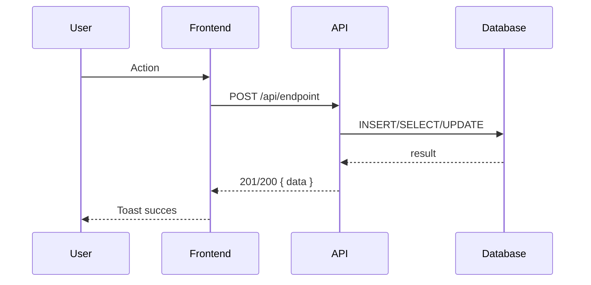
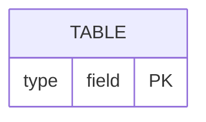

Propose a new change - create the change and generate all artifacts in one step.

I'll create a change with artifacts:
- proposal.md (what & why)
- design.md (how)
- tasks.md (implementation steps)

When ready to implement, run /opsx:apply

---

**Input**: The user's request should include a change name (kebab-case) OR a description of what they want to build.

## Project Rules (MANDATORY)

### 0. Langue : Français

TOUS les artifacts OpenSpec (proposal.md, design.md, specs, tasks.md, progress.md) DOIVENT être rédigés en **français**. Cela inclut :
- Les titres de sections
- Les descriptions, décisions, justifications
- Les scénarios dans les specs (QUAND/ALORS au lieu de WHEN/THEN)
- Les noms de tâches dans tasks.md
- Les commentaires dans les diagrammes Mermaid (participants en français)

Seuls les éléments techniques restent en anglais : noms de fichiers, chemins, code, types TypeScript, endpoints API, noms de branches git.

### A. Create branch before work

When creating a change, ALWAYS create a git branch first. After step 2 (creating the change directory), execute:

```bash
# Check current branch
BRANCH=$(git branch --show-current)
if [ "$BRANCH" = "main" ]; then
  FEATURE_SLUG=$(echo "<name>" | tr '[:upper:]' '[:lower:]' | sed 's/[^a-z0-9]/-/g' | cut -c1-30)
  git checkout -b feat/$FEATURE_SLUG
fi
```

This is step 1.5: after creating the change directory, before getting artifact build order.

### B. Mermaid sequence diagrams OBLIGATORY in design.md

When creating the design artifact, ALWAYS include sequence diagrams:

| Type de changement | Diagrammes requis |
|-------------------|-------------------|
| Module CRUD | 4 sequences : Create, Read, Update, Delete |
| Nouvelle feature | Flux principal + cas d'erreur |
| Integration API externe | Appels sortants + callbacks/webhooks |
| Workflow multi-etapes | Sequence complete avec etats |

Format:

~~~markdown
## Sequence Diagrams

### Flux : <action>


~~~

Also include **Data Model (ERD)** if new tables are created:

~~~markdown

~~~

And **State Diagram** if entity has statuses.

### C. Proposal format additions

The proposal MUST also include:

- **Existant (a reutiliser)**: Elements already in codebase to reuse
- **Scope (a implementer)**: Files to create, files to modify
- **Out of Scope**: What is explicitly excluded and why
- **Regles UI**: ModuleHeader usage checklist (if UI is involved)

### D. Design format additions

The design MUST include:

- **API Contracts** table (Method | Path | Description)
- **Payloads** (TypeScript interfaces for request/response)
- **Sequence Diagrams** (as described in rule B -- MANDATORY)
- **Data Model** (ERD if new tables)

### E. Initialize progress.md

After creating all artifacts, create a `progress.md` file in the change directory:

```markdown
# Progress: <feature-name>

## Metadata
- Type: feature
- Branch: feat/<slug>
- Parent Branch: main
- Started: <ISO8601>
- Current Phase: proposal

## Phases

### [x] Proposal (<timestamp>)
- proposal.md created
- Scope defined

### [x] Design (<timestamp>)
- Architecture decisions documented
- API contracts defined
- Sequence diagrams: X diagrams
- Data model: Yes/No

### [ ] Implementation
### [ ] Verification
### [ ] Testing
### [ ] Archive

## History
- <timestamp>: Change created via /opsx:propose
```

### F. Bug detection and /opsx:fix workflow

If the user reports a bug or anomaly (keywords: "bug", "erreur", "ne marche pas", "corrige", "fix", "probleme"), automatically:

1. Create branch: `fix/<slug>` from main, or `fix/<parent>--<slug>` from a feature branch
2. Create change dir: `openspec/changes/fix-<slug>/`
3. Generate proposal.md with: current behavior vs expected behavior
4. Generate design.md with: "Flux actuel (BUG)" + "Flux corrige (FIX)" sequence diagrams
5. Generate tasks.md with correction steps

---

**Steps**

1. **If no clear input provided, ask what they want to build**

   Use the **AskUserQuestion tool** (open-ended, no preset options) to ask:
   > "What change do you want to work on? Describe what you want to build or fix."

   From their description, derive a kebab-case name (e.g., "add user authentication" → `add-user-auth`).

   **IMPORTANT**: Do NOT proceed without understanding what the user wants to build.

2. **Create the change directory**
   ```bash
   openspec new change "<name>"
   ```
   This creates a scaffolded change at `openspec/changes/<name>/` with `.openspec.yaml`.

3. **Get the artifact build order**
   ```bash
   openspec status --change "<name>" --json
   ```
   Parse the JSON to get:
   - `applyRequires`: array of artifact IDs needed before implementation (e.g., `["tasks"]`)
   - `artifacts`: list of all artifacts with their status and dependencies

4. **Create artifacts in sequence until apply-ready**

   Use the **TodoWrite tool** to track progress through the artifacts.

   Loop through artifacts in dependency order (artifacts with no pending dependencies first):

   a. **For each artifact that is `ready` (dependencies satisfied)**:
      - Get instructions:
        ```bash
        openspec instructions <artifact-id> --change "<name>" --json
        ```
      - The instructions JSON includes:
        - `context`: Project background (constraints for you - do NOT include in output)
        - `rules`: Artifact-specific rules (constraints for you - do NOT include in output)
        - `template`: The structure to use for your output file
        - `instruction`: Schema-specific guidance for this artifact type
        - `outputPath`: Where to write the artifact
        - `dependencies`: Completed artifacts to read for context
      - Read any completed dependency files for context
      - Create the artifact file using `template` as the structure
      - Apply `context` and `rules` as constraints - but do NOT copy them into the file
      - Show brief progress: "Created <artifact-id>"

   b. **Continue until all `applyRequires` artifacts are complete**
      - After creating each artifact, re-run `openspec status --change "<name>" --json`
      - Check if every artifact ID in `applyRequires` has `status: "done"` in the artifacts array
      - Stop when all `applyRequires` artifacts are done

   c. **If an artifact requires user input** (unclear context):
      - Use **AskUserQuestion tool** to clarify
      - Then continue with creation

5. **Show final status**
   ```bash
   openspec status --change "<name>"
   ```

**Output**

After completing all artifacts, summarize:
- Change name and location
- List of artifacts created with brief descriptions
- What's ready: "All artifacts created! Ready for implementation."
- Prompt: "Run `/opsx:apply` or ask me to implement to start working on the tasks."

**Artifact Creation Guidelines**

- Follow the `instruction` field from `openspec instructions` for each artifact type
- The schema defines what each artifact should contain - follow it
- Read dependency artifacts for context before creating new ones
- Use `template` as the structure for your output file - fill in its sections
- **IMPORTANT**: `context` and `rules` are constraints for YOU, not content for the file
  - Do NOT copy `<context>`, `<rules>`, `<project_context>` blocks into the artifact
  - These guide what you write, but should never appear in the output

**Guardrails**
- Create ALL artifacts needed for implementation (as defined by schema's `apply.requires`)
- Always read dependency artifacts before creating a new one
- If context is critically unclear, ask the user - but prefer making reasonable decisions to keep momentum
- If a change with that name already exists, ask if user wants to continue it or create a new one
- Verify each artifact file exists after writing before proceeding to next
