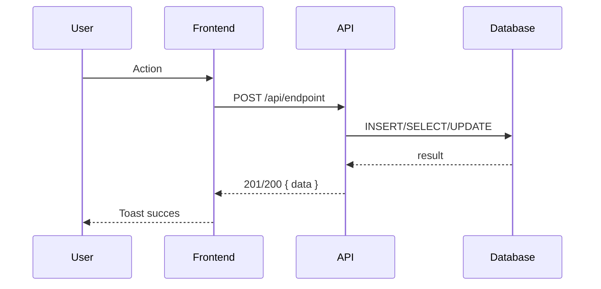
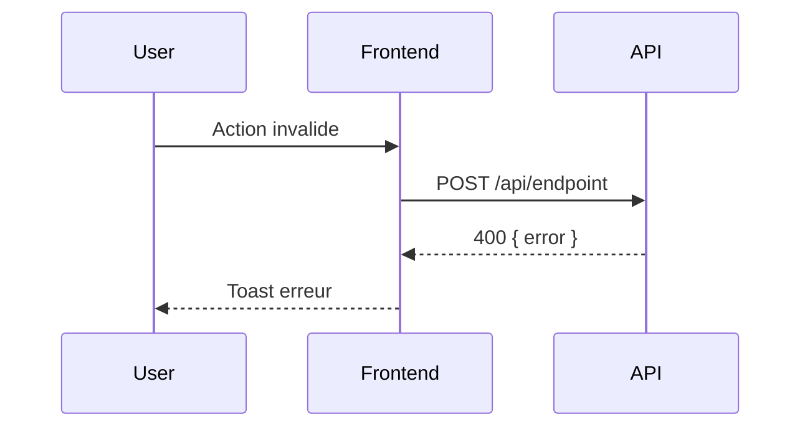
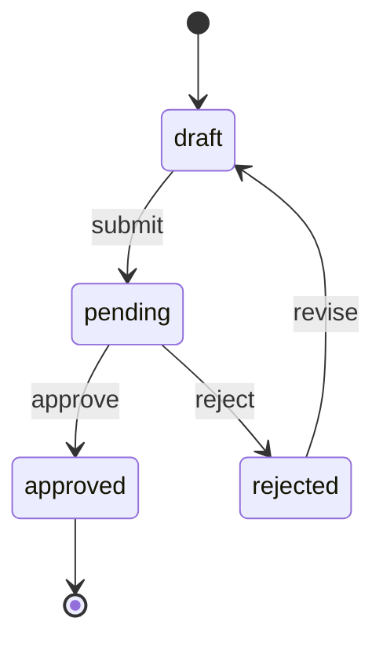
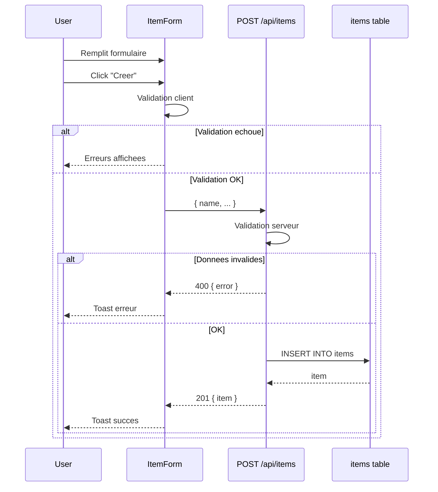
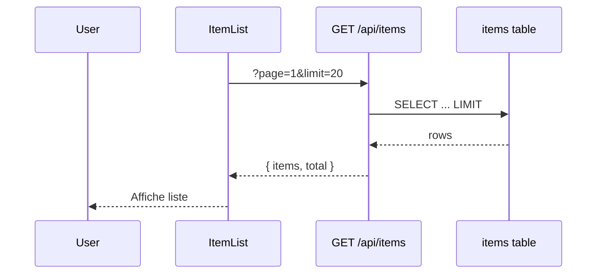
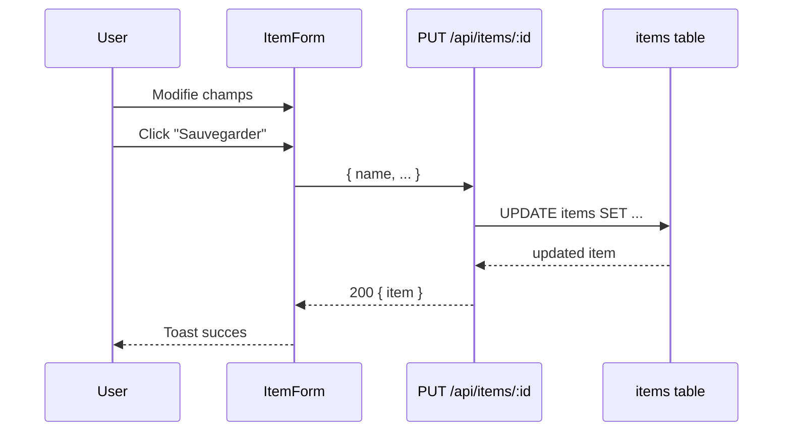
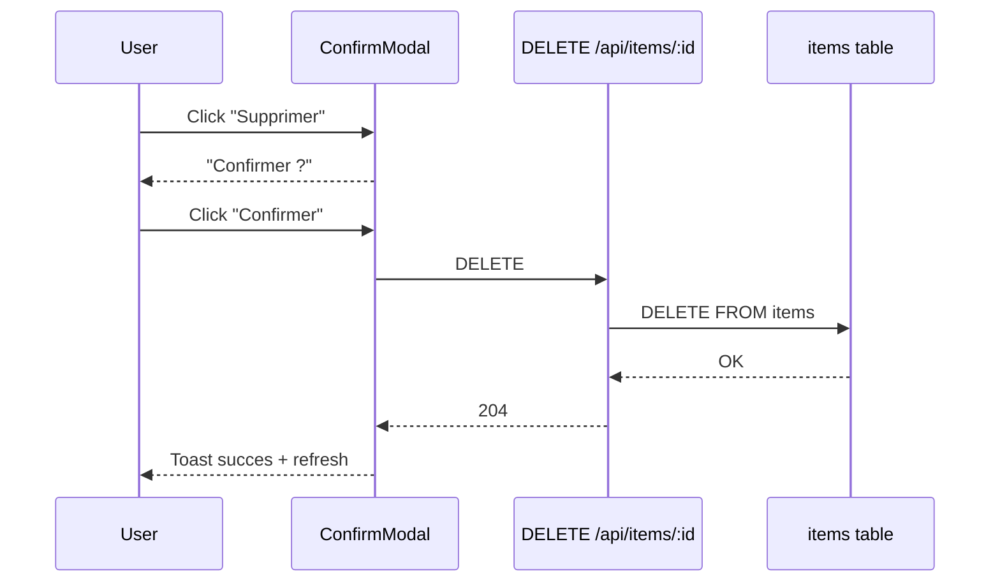
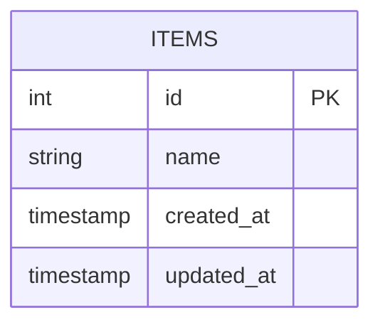

# OpenSpec - Spec-Driven Development

Ce skill utilise l'outil **@fission-ai/openspec** pour un developpement specification-first.

## REGLES OBLIGATOIRES

### 1. Creer une branche AVANT tout travail

Quand tu recois `/opsx:propose "description"` :

```bash
# 1. Verifier qu'on n'est pas deja sur une branche feature
git branch --show-current

# 2. Si on est sur main, creer la branche
git checkout -b feat/<feature-slug>
```

Le `<feature-slug>` est derive de la description (kebab-case, max 30 chars).

### 2. Generer des diagrammes de sequence Mermaid (OBLIGATOIRE)

Chaque changement DOIT inclure au moins un diagramme de sequence dans `design.md`.

**Quand generer quoi :**

| Type de changement | Diagrammes requis |
|-------------------|-------------------|
| Module CRUD | 4 sequences : Create, Read, Update, Delete |
| Nouvelle feature | Flux principal + cas d'erreur |
| Integration API externe | Appels sortants + callbacks/webhooks |
| Workflow multi-etapes | Sequence complete avec etats |

**Format obligatoire dans design.md :**

```markdown
## Sequence Diagrams

### Flux principal : <action>



### Flux erreur : <cas d'erreur>


```

**Pour les entites avec statuts, ajouter un diagramme d'etat :**

```markdown
## State Diagram


```

### 3. Persister l'etat dans progress.md

A CHAQUE changement de phase, mettre a jour `.openspec/changes/<feature>/progress.md` :

```markdown
# Progress: <feature-name>

## Metadata
- Branch: feat/<feature-slug>
- Started: 2024-01-15T10:30:00Z
- Current Phase: implementation

## Phases

### [x] Proposal (2024-01-15T10:30:00Z)
- Created proposal.md
- Defined scope and objectives

### [x] Design (2024-01-15T10:45:00Z)
- Architecture decisions documented
- API contracts defined

### [ ] Implementation (in progress)
- Started: 2024-01-15T11:00:00Z
- Tasks completed: 2/5
- Current task: "Creer les routes API"

### [ ] Verification
### [ ] Testing
### [ ] Archive
```

Ce fichier DOIT etre mis a jour a chaque etape pour survivre a la compaction de conversation.

## Workflow Detaille

### /opsx:propose "description"

1. **Verifier le mode OpenSpec**
   ```bash
   cat .claude/config 2>/dev/null | grep OPENSPEC_MODE || echo "on"
   ```

2. **Creer la branche** (si on est sur main)
   ```bash
   FEATURE_SLUG=$(echo "description" | tr '[:upper:]' '[:lower:]' | sed 's/[^a-z0-9]/-/g' | cut -c1-30)
   git checkout -b feat/$FEATURE_SLUG
   ```

3. **Creer le dossier OpenSpec**
   ```bash
   mkdir -p .openspec/changes/$FEATURE_SLUG
   ```

4. **Generer les fichiers de spec** :
   - `proposal.md` - Description, objectifs, scope
   - `specs/` - Specifications techniques detaillees
   - `design.md` - Decisions d'architecture + **diagrammes Mermaid obligatoires**
   - `tasks.md` - Liste des taches numerotees

5. **Generer les diagrammes dans design.md** :
   - Identifier le type de changement (CRUD, feature, integration, workflow)
   - Generer les diagrammes de sequence appropries
   - Ajouter diagramme d'etat si entite avec statuts

6. **Initialiser progress.md** avec la phase "Proposal" completee

7. **Afficher le resume** et demander validation

### /opsx:apply

1. **Lire progress.md** pour reprendre le contexte
2. **Lire tasks.md** pour voir les taches restantes
3. **Mettre a jour progress.md** : phase = "Implementation"
4. **Executer les taches** une par une
5. **Mettre a jour progress.md** apres chaque tache completee

### /opsx:verify

1. **Lire progress.md** et les specs
2. **Verifier** que l'implementation correspond aux specs
3. **Mettre a jour progress.md** : phase = "Verification"
4. **Lister** les ecarts trouves ou confirmer la conformite

### /opsx:continue

1. **Lire progress.md** pour connaitre l'etat actuel
2. **Reprendre** la ou on en etait
3. Utile apres une compaction de conversation

### /opsx:status

1. **Lire progress.md**
2. **Afficher** un resume de l'etat actuel :
   - Branche courante
   - Phase en cours
   - Taches completees/restantes
   - Derniere activite

### /opsx:archive

1. **Verifier** que les tests passent : `npm test`
2. **Mettre a jour progress.md** : phase = "Archive", status = "completed"
3. **Optionnel** : deplacer vers `.openspec/archive/`

## Structure des Fichiers

```
.openspec/
├── config.yaml
└── changes/
    └── <feature-slug>/
        ├── proposal.md      # Description et scope
        ├── specs/           # Specifications detaillees
        │   ├── api.md
        │   └── data.md
        ├── design.md        # Architecture + DIAGRAMMES MERMAID
        ├── tasks.md         # Liste des taches
        └── progress.md      # ETAT PERSISTANT (survit a la compaction)
```

## Format de design.md

```markdown
# Design: <feature-name>

## Architecture Decisions

- Decision 1: [description]
- Decision 2: [description]

## API Contracts

### Endpoints

| Method | Path | Description |
|--------|------|-------------|
| POST | /api/items | Creer un item |
| GET | /api/items | Lister les items |
| PUT | /api/items/:id | Modifier un item |
| DELETE | /api/items/:id | Supprimer un item |

### Payloads

```typescript
// Request
interface CreateItemRequest {
  name: string;
  // ...
}

// Response
interface ItemResponse {
  id: number;
  name: string;
  createdAt: string;
}
```

## Sequence Diagrams

### Create Item



### List Items



### Update Item



### Delete Item



## State Diagram (si applicable)


## Data Model


```

## Format de progress.md

```markdown
# Progress: <feature-name>

## Metadata
- Branch: feat/<slug>
- Started: <ISO8601>
- Current Phase: proposal|design|implementation|verification|testing|archive
- Status: in_progress|blocked|completed

## Phases

### [x] Proposal (<timestamp>)
- proposal.md created
- Scope defined

### [x] Design (<timestamp>)
- Architecture decisions documented
- API contracts defined
- Sequence diagrams: X (Create, Read, Update, Delete)
- State diagram: Yes/No
- Data model: Yes/No

### [ ] Implementation
- Started: <timestamp>
- Tasks: X/Y completed
- Current: "<task description>"
- Notes:
  - <any blockers or decisions>

### [ ] Verification
### [ ] Testing
### [ ] Archive

## History
- <timestamp>: <action taken>
- <timestamp>: <action taken>
```

## Reprise apres Compaction

Si la conversation est compactee et tu perds le contexte :

1. **Lire progress.md** en premier
2. **Lire tasks.md** pour les taches
3. **Reprendre** exactement ou tu en etais

Le fichier progress.md est la SOURCE DE VERITE pour l'etat du travail.

## Integration Git

| Phase | Action Git |
|-------|------------|
| propose | `git checkout -b feat/<slug>` |
| apply | commits incrementaux |
| verify | - |
| archive | PR ready, merge vers main |

## Checklist par Phase

### Proposal
- [ ] Branche creee
- [ ] proposal.md ecrit
- [ ] design.md avec diagrammes Mermaid
- [ ] tasks.md defini
- [ ] progress.md initialise

### Design (dans design.md)
- [ ] Architecture decisions documentees
- [ ] API contracts definis
- [ ] Diagrammes de sequence (OBLIGATOIRE)
- [ ] Diagramme d'etat (si entite avec statuts)
- [ ] Data model (ERD si nouvelle table)

### Implementation
- [ ] Chaque tache = 1 commit
- [ ] Tests ecrits
- [ ] progress.md mis a jour

### Verification
- [ ] Specs respectees
- [ ] Diagrammes correspondent a l'implementation
- [ ] Tests passent
- [ ] Code review ready

### Archive
- [ ] `npm test` passe
- [ ] Documentation a jour
- [ ] PR cree ou merge effectue
