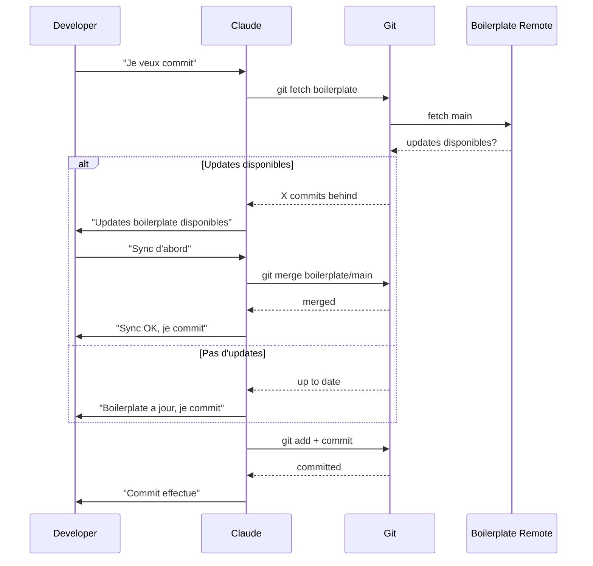
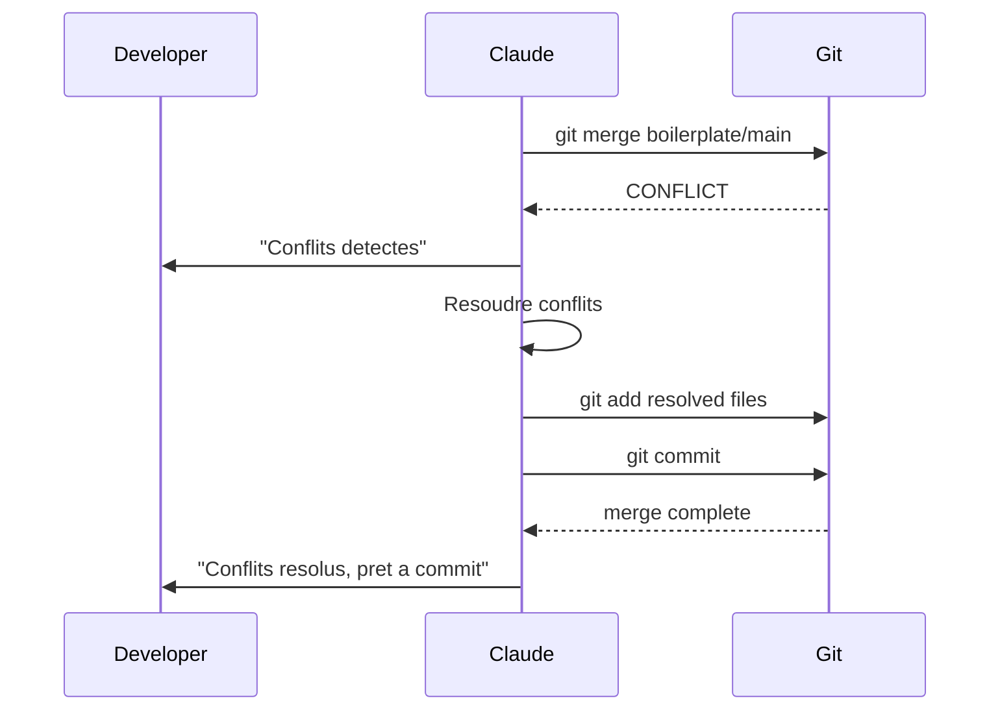
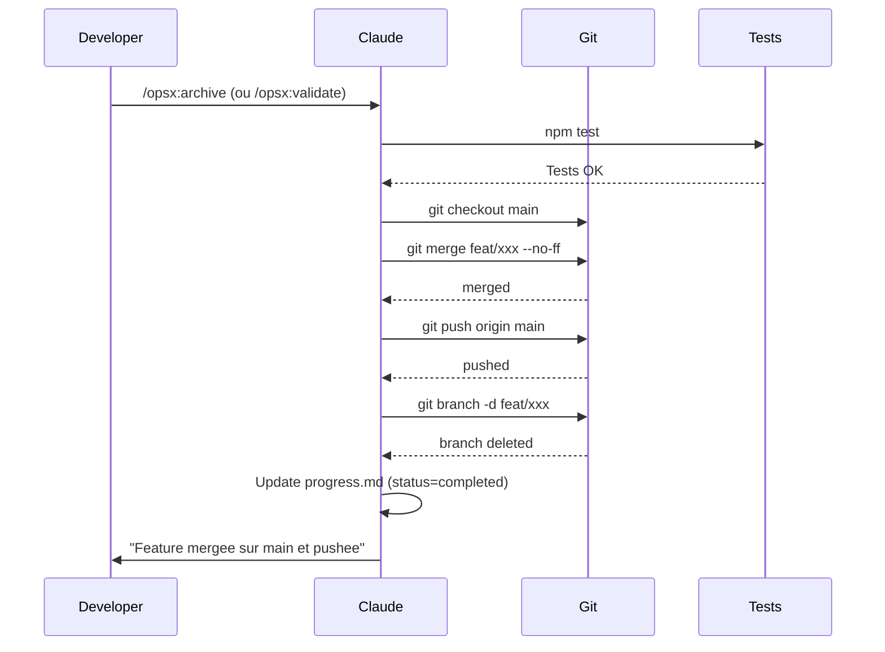

# Design: Auto-sync with Boilerplate Before Commit

## Architecture Decision

Ajouter une **regle obligatoire** dans CLAUDE.md pour les projets derives :
- Avant chaque commit, verifier si des updates boilerplate sont disponibles
- Si oui, les appliquer avant de commit

## Workflow

### Sequence: Commit avec sync

### Sequence: Conflit lors du sync

## Implementation

### Option 1: Instruction dans CLAUDE.md (Recommande)

Ajouter une section "Projets Derives" dans CLAUDE.md avec la regle de sync.

### Option 2: Skill dedie

Creer un skill `sync-check` qui est appele automatiquement avant commit.

**Decision**: Option 1 - Plus simple, pas besoin de skill supplementaire.

### Sequence: Archive/Validate avec merge automatique

## Changes Required

1. CLAUDE.md : Ajouter section "Projets Derives - Sync Obligatoire"
2. OpenSpec skill : Confirmer que `/opsx:archive` merge automatiquement sur parent (deja fait)
