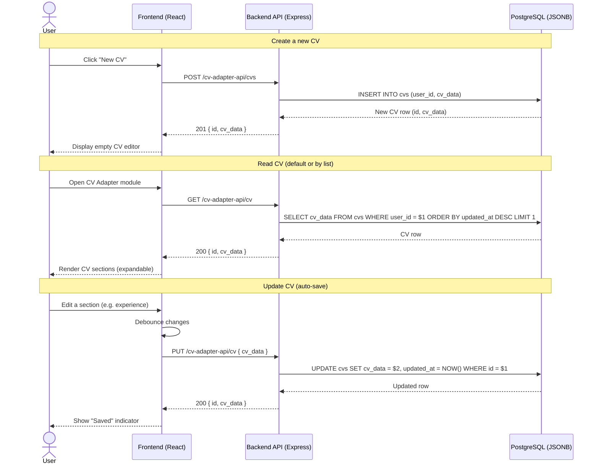
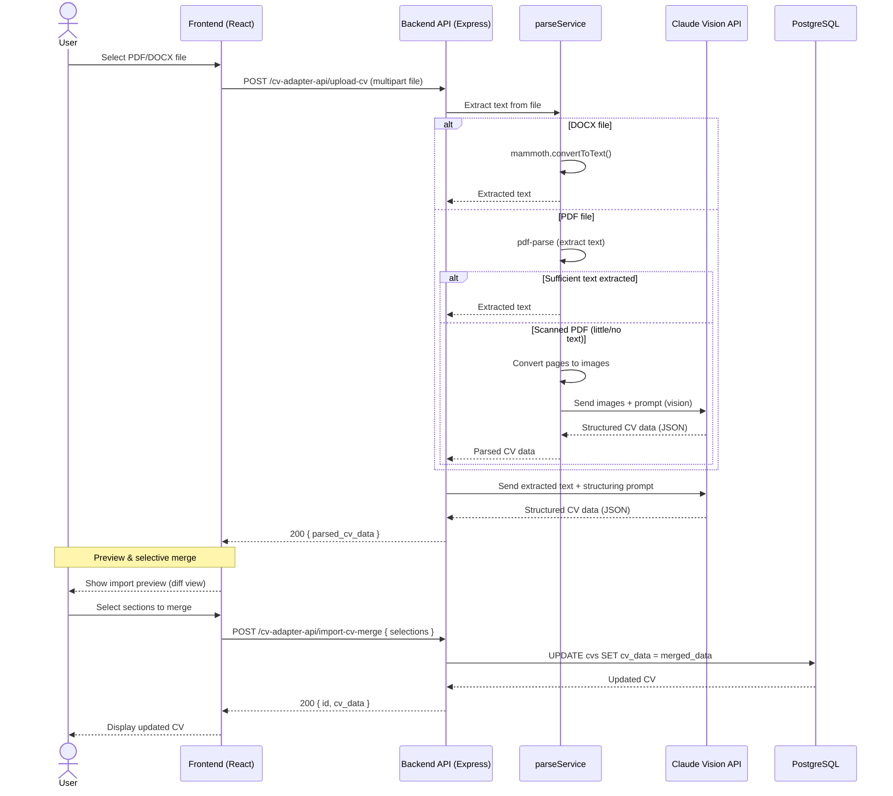
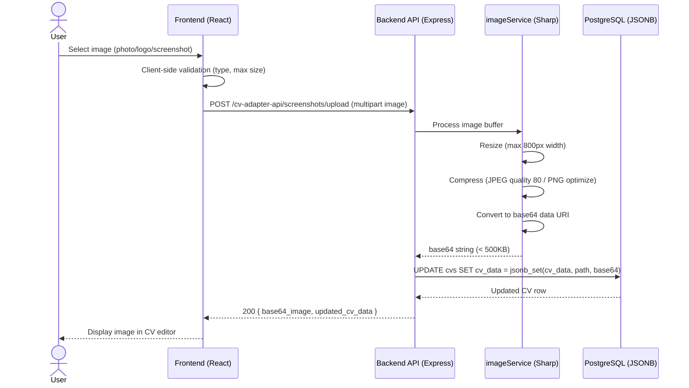

## Context

La plateforme boilerplate dispose deja d'un systeme d'authentification (gateway) et d'un module exemple (products). Le module cv-adapter doit s'integrer dans cette architecture existante en suivant les patterns etablis.

Le projet cv-tools existant dans le workspace contient une implementation de reference complete qu'il faut adapter au boilerplate actuel.

## Goals / Non-Goals

**Goals:**
- Permettre aux utilisateurs de creer et editer des CVs complets
- Supporter l'import de CVs PDF/DOCX avec parsing IA
- Gerer les medias (photos, logos, screenshots) de maniere performante
- Fournir une UX fluide avec auto-save et sections expandables
- Suivre les patterns du boilerplate (structure modules, tests, design system)

**Non-Goals:**
- Adaptation IA des CVs aux offres (Phase 2)
- Generation PDF (Phase 2)
- Autofill de formulaires externes (Phase 3)
- Extensions Chrome (Phase 3)
- Integration Collective.work (hors scope)

## Decisions

### 1. Structure de donnees CV en JSONB

**Decision**: Stocker les donnees CV dans une colonne JSONB PostgreSQL plutot que des tables relationnelles normalisees.

**Rationale**:
- Flexibilite pour ajouter des champs sans migration
- Structure hierarchique naturelle (experiences > missions > projets)
- Performances de lecture optimales (pas de JOINs)
- Le projet cv-tools utilise cette approche avec succes

**Alternatives considerees**:
- Tables normalisees: rejetee car trop de JOINs complexes pour la lecture

### 2. Parsing IA avec Claude Vision

**Decision**: Utiliser Claude claude-sonnet-4-20250514 avec capacites vision pour parser les PDFs.

**Rationale**:
- Gere les PDFs scannes (images) et les PDFs texte
- Extraction semantique intelligente des sections
- Meme API que pour l'adaptation (Phase 2)

**Implementation**:
- pdf-parse pour extraction texte d'abord
- Si peu de texte extrait, convertir en image et utiliser vision
- mammoth pour les fichiers DOCX

### 3. Stockage des images en base64 inline

**Decision**: Les images (photos profil, logos) sont stockees en base64 dans le JSONB du CV.

**Rationale**:
- Simplifie la generation PDF (pas de fetch externe)
- Backup/restore complet du CV en une operation
- Taille acceptable (photos <500KB compressees)

**Alternatives considerees**:
- Stockage fichiers sur disque: complexifie le deploiement et les backups
- Stockage S3/cloud: overkill pour cette phase

### 4. Table cv_logos separee pour le cache

**Decision**: Les logos d'entreprises sont caches dans une table separee cv_logos.

**Rationale**:
- Evite la duplication quand plusieurs CVs utilisent le meme logo
- Permet le partage entre utilisateurs (meme entreprise)
- Reduce la taille du JSONB principal

### 5. Architecture API REST standard

**Decision**: API REST avec endpoints CRUD classiques suivant les patterns du boilerplate.

**Endpoints**:
```
GET    /cv-adapter-api/cv           # CV par defaut de l'utilisateur
PUT    /cv-adapter-api/cv           # Mise a jour du CV
GET    /cv-adapter-api/my-cvs       # Liste tous les CVs
POST   /cv-adapter-api/cvs          # Creer un nouveau CV
DELETE /cv-adapter-api/cvs/:id      # Supprimer un CV

POST   /cv-adapter-api/upload-cv           # Import PDF/DOCX
POST   /cv-adapter-api/import-cv-preview   # Preview avant merge
POST   /cv-adapter-api/import-cv-merge     # Merge selectif

POST   /cv-adapter-api/screenshots/upload  # Upload images
POST   /cv-adapter-api/logos/upload        # Upload logo
GET    /cv-adapter-api/logos               # Liste logos
GET    /cv-adapter-api/logos/:id/image     # Image du logo
POST   /cv-adapter-api/fetch-company-logo  # Auto-fetch logo
```

### 6. Interface utilisateur avec sections expandables

**Decision**: Utiliser des sections collapsibles pour chaque partie du CV.

**Rationale**:
- Evite le scroll infini
- Permet de se concentrer sur une section a la fois
- Pattern UX eprouve pour les formulaires longs

**Composants**:
- ExpandableSection: wrapper avec toggle
- TagEditor: pour les competences (skills, outils, etc.)
- ListEditor: pour les listes (missions, projets)
- ImageUploader: pour photos/logos/screenshots

## Sequence Diagrams

### 1. CV CRUD Flow



### 2. CV Import PDF/DOCX Flow



### 3. Image Upload Flow



## Risks / Trade-offs

### R1: Taille des images en base64
**Risque**: CVs avec beaucoup d'images peuvent devenir volumineux (>5MB)
**Mitigation**: Compression cote client, limite de taille par image (500KB), avertissement UI

### R2: Cout API Anthropic
**Risque**: Le parsing IA peut etre couteux pour des gros PDFs
**Mitigation**: Cache des resultats, limite du nombre d'imports par jour

### R3: Compatibilite PDF
**Risque**: Certains PDFs complexes peuvent mal se parser
**Mitigation**: Fallback sur extraction texte basique, possibilite d'edition manuelle

### R4: Performance du JSONB
**Risque**: Requetes sur champs JSONB peuvent etre lentes
**Mitigation**: Index GIN sur cv_data si necessaire, requetes simples (pas de filtrage complexe)
