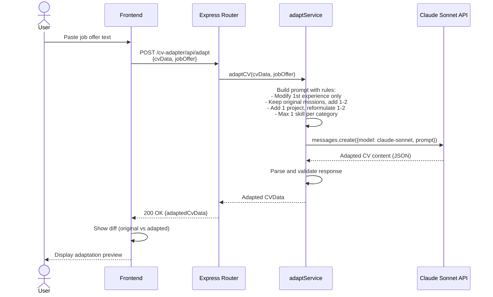
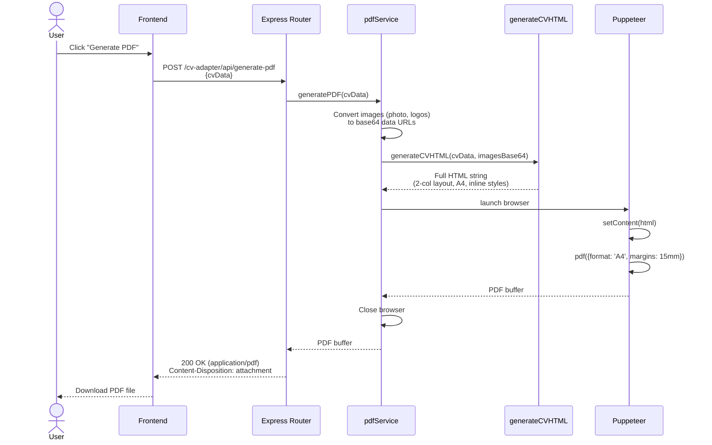
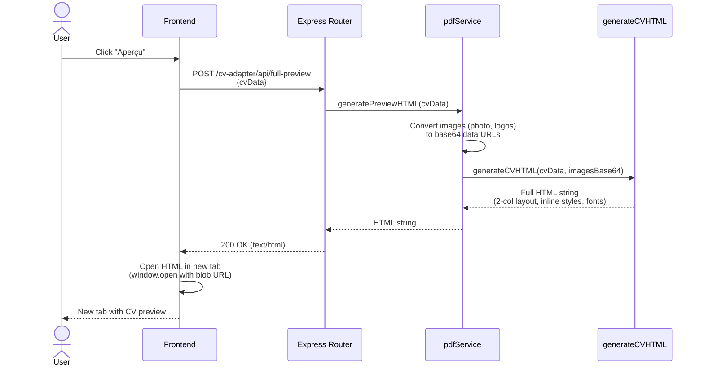

## Context

Le module CV Adapter Phase 1 est implémenté avec :
- Backend : Express routes dans `apps/platform/servers/unified/src/modules/cv-adapter/`
- Frontend : React dans `apps/platform/src/modules/cv-adapter/`
- Base de données : PostgreSQL avec tables `cvs` (JSONB) et `cv_logos`
- Services existants : `parseService.ts` (parsing PDF/DOCX via Claude), `imageService.ts` (Sharp)

Le projet de référence `cv-tools` utilise déjà Claude API pour l'adaptation et Puppeteer pour le PDF. Cette phase intègre ces fonctionnalités dans le boilerplate.

## Goals / Non-Goals

**Goals:**
- Adapter automatiquement un CV aux requirements d'une offre d'emploi
- Générer des missions et projets pertinents via Claude API
- Exporter le CV en PDF avec un layout professionnel 2 colonnes
- Fournir un preview HTML fidèle avant export
- Interface utilisateur intuitive pour l'adaptation

**Non-Goals:**
- Stockage des offres d'emploi (input ponctuel, non persisté)
- Historique des adaptations (hors scope Phase 2)
- Templates PDF multiples (un seul style terminal)
- Génération DOCX (PDF uniquement)

## Decisions

### 1. Architecture des services IA

**Décision**: Créer `adaptService.ts` séparé de `parseService.ts`

**Rationale**: Le parsing (extraction de données) et l'adaptation (génération de contenu) sont des responsabilités distinctes. Séparer permet de tester et maintenir indépendamment.

**Alternative considérée**: Tout dans `parseService.ts` - rejeté car mélange extraction et génération.

### 2. Modèle Claude pour l'adaptation

**Décision**: Utiliser `claude-sonnet-4-20250514` pour l'adaptation CV

**Rationale**: Bon équilibre coût/qualité pour la génération de texte structuré. Suffisant pour analyser une offre et générer des missions cohérentes.

**Alternative considérée**: `claude-opus-4-5-20251101` - réservé pour Phase 3 (autofill forms) où la qualité maximale est critique.

### 3. Règles d'adaptation strictes

**Décision**: Appliquer des règles métier fixes dans le prompt :
- Modifier UNIQUEMENT la 1ère expérience
- Garder toutes les missions originales, ajouter 1-2 nouvelles à la fin
- Ajouter 1 projet en 1ère position, reformuler 1-2 existants
- Max 1 compétence par catégorie (competences, outils, dev, frameworks, solutions)

**Rationale**: Évite que l'IA dénature complètement le CV. Approche conservative qui enrichit sans remplacer.

### 4. Génération PDF avec Puppeteer

**Décision**: Puppeteer côté serveur avec template HTML inline

**Rationale**:
- Contrôle total sur le rendu (pas de dépendance à des libs PDF limitées)
- Images en base64 inline évitent les problèmes de chemins
- Style CSS identique au preview HTML

**Alternative considérée**:
- `pdfmake` / `jsPDF` - limités pour layouts complexes 2 colonnes
- WeasyPrint - nécessite Python

### 5. Layout PDF 2 colonnes

**Décision**:
- Sidebar gauche (280px) : photo, contact, compétences
- Main droite (520px) : expériences, formations, projets, awards
- Format A4 (210mm × 297mm), marges 15mm

**Rationale**: Layout classique de CV professionnel. La sidebar permet de scanner rapidement les compétences.

### 6. Images base64 inline

**Décision**: Convertir toutes les images (photo profil, logos) en base64 data URLs avant génération PDF

**Rationale**: Puppeteer génère le PDF en isolation. Les URLs relatives ou absolues vers le serveur ne fonctionnent pas. Base64 garantit que les images sont embarquées.

### 7. Preview HTML séparé du PDF

**Décision**: Endpoint `/preview` retourne le HTML brut, `/preview-pdf` retourne un PDF inline (Content-Disposition: inline)

**Rationale**: Le preview HTML est instantané et permet d'itérer rapidement. Le preview PDF confirme le rendu final exact.

## Sequence Diagrams

### 1. CV Adaptation Flow

### 2. PDF Generation Flow

### 3. HTML Preview Flow

## Risks / Trade-offs

### [Puppeteer lourd en production]
Puppeteer installe Chromium (~300MB).
→ **Mitigation**: Utiliser `puppeteer-core` en prod avec Chrome système, ou accepter le poids pour la simplicité.

### [Coût API Claude]
Chaque adaptation consomme des tokens Claude.
→ **Mitigation**: Utiliser Sonnet (moins cher qu'Opus). Limiter le contexte envoyé (résumé de l'offre, pas le texte complet).

### [Temps de génération PDF]
Puppeteer peut prendre 2-5 secondes pour générer un PDF.
→ **Mitigation**: Afficher un loader côté frontend. Le preview HTML est instantané pour itérer.

### [Qualité de l'adaptation IA]
L'IA peut générer du contenu non pertinent ou exagéré.
→ **Mitigation**: Preview obligatoire avant validation. L'utilisateur valide chaque adaptation.

### [Fonts dans le PDF]
Les fonts custom (Playfair Display) doivent être disponibles.
→ **Mitigation**: Utiliser Google Fonts via CDN dans le HTML, Puppeteer les chargera.
