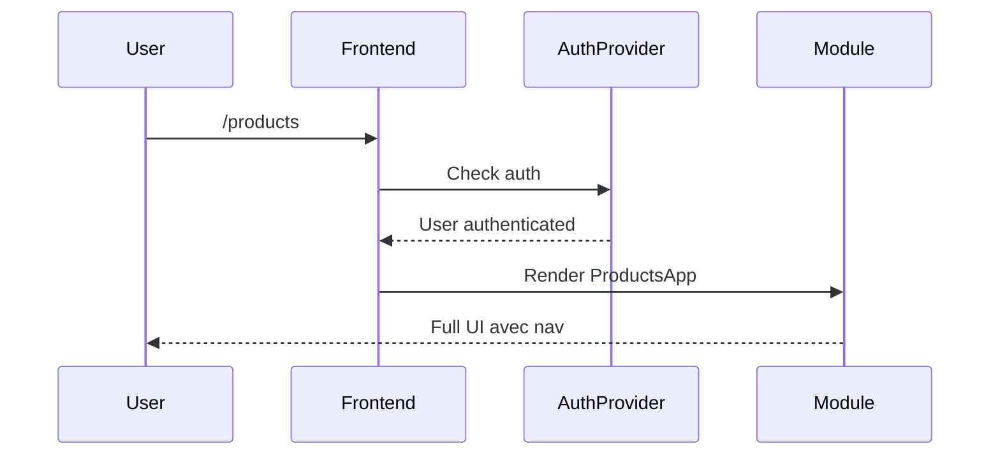
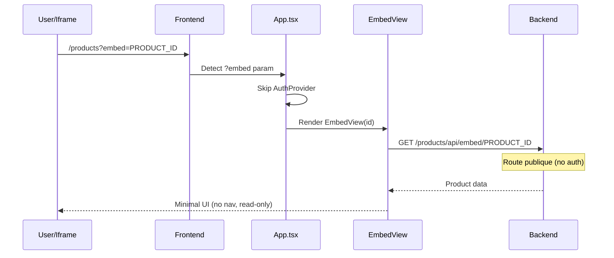
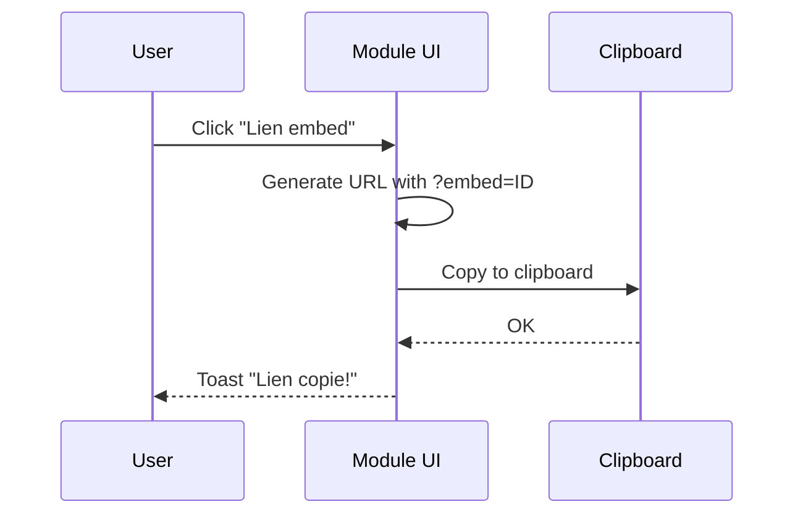

# Design: Embed Support in Module Creator

## Architecture Decision

Le mode embed est detecte par un parametre URL `?embed=ID`. Quand present :
1. Frontend skip l'authentification
2. Affiche un composant `EmbedView` minimaliste (sans nav)
3. Backend expose une route publique `/embed/:id`

## Sequence Diagrams

### Acces normal (authentifie)



### Acces embed (public)



### Copier lien embed



## API Contracts

### Route publique embed (backend)

```typescript
// GET /module/api/embed/:id
// NO AUTH REQUIRED

router.get('/embed/:id', asyncHandler(async (req, res) => {
  const item = await db.getById(req.params.id);
  if (!item) {
    res.status(404).json({ error: 'Not found' });
    return;
  }
  res.json(item);
}));

// Auth middleware applied AFTER embed route
router.use(authMiddleware);
// ... protected routes
```

## Component Structure

### EmbedView.tsx (genere par module-creator)

```tsx
interface EmbedViewProps {
  itemId: string;
}

export function EmbedView({ itemId }: EmbedViewProps) {
  const [item, setItem] = useState<Item | null>(null);
  const [isDark, setIsDark] = useState(true);

  useEffect(() => {
    fetchEmbed(itemId).then(setItem);
  }, [itemId]);

  useEffect(() => {
    document.documentElement.setAttribute('data-theme', isDark ? 'dark' : 'light');
  }, [isDark]);

  if (!item) return <div className="embed-loading">Chargement...</div>;

  return (
    <div className={`embed-app ${isDark ? 'embed-dark' : 'embed-light'}`}>
      <div className="embed-header">
        <h1 className="embed-title">{item.name}</h1>
        <button className="embed-theme-toggle" onClick={() => setIsDark(!isDark)}>
          {isDark ? '☀️' : '🌙'}
        </button>
      </div>
      <div className="embed-content">
        {/* Render item data read-only */}
      </div>
    </div>
  );
}
```

### App.tsx modification (core)

```tsx
// Detection embed mode
function getEmbedParam(): string | null {
  const params = new URLSearchParams(window.location.search);
  return params.get('embed');
}

function App() {
  const embedId = getEmbedParam();

  // Skip auth si embed mode
  if (embedId) {
    return <AppRouter embedMode embedId={embedId} />;
  }

  // Normal auth flow
  return (
    <AuthProvider>
      <AppContent />
    </AuthProvider>
  );
}
```

## CSS Embed (minimal)

```css
.embed-app {
  height: 100vh;
  display: flex;
  flex-direction: column;
  background: var(--bg-primary);
  color: var(--text-primary);
}

.embed-header {
  display: flex;
  justify-content: space-between;
  align-items: center;
  padding: var(--spacing-md) var(--spacing-lg);
  border-bottom: 1px solid var(--border-color);
}

.embed-title {
  font-size: var(--font-size-lg);
  font-weight: var(--font-weight-semibold);
  margin: 0;
}

.embed-theme-toggle {
  background: transparent;
  border: 1px solid var(--border-color);
  padding: var(--spacing-xs) var(--spacing-sm);
  cursor: pointer;
  border-radius: var(--radius-sm);
  font-size: var(--font-size-base);
}

.embed-content {
  flex: 1;
  overflow: auto;
  padding: var(--spacing-lg);
}

.embed-loading {
  display: flex;
  align-items: center;
  justify-content: center;
  height: 100vh;
  color: var(--text-muted);
}
```

## Files to Modify/Create

### Core boilerplate
1. `apps/platform/src/App.tsx` - Detection embed mode
2. `apps/platform/src/router.tsx` - Support embedMode prop

### Skill module-creator
1. `.claude/skills/module-creator/skill.md` - Ajouter option embed + templates

### Generated by skill (si embed active)
1. `EmbedView.tsx` - Composant embed
2. `services/api.ts` - Ajouter `fetchEmbed()`
3. `routes.ts` - Route publique `/embed/:id`
4. `index.css` - Styles embed
