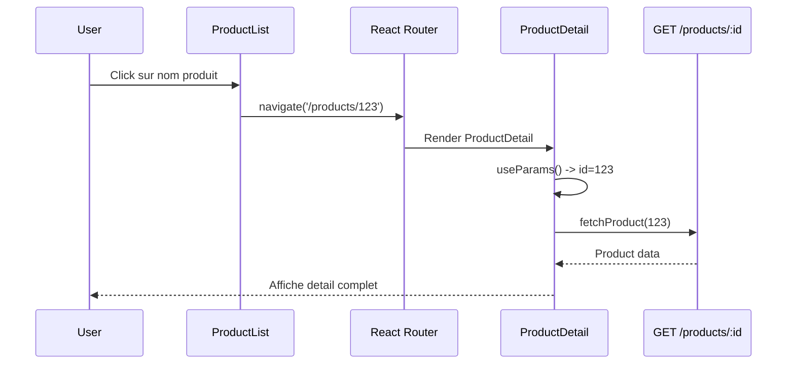
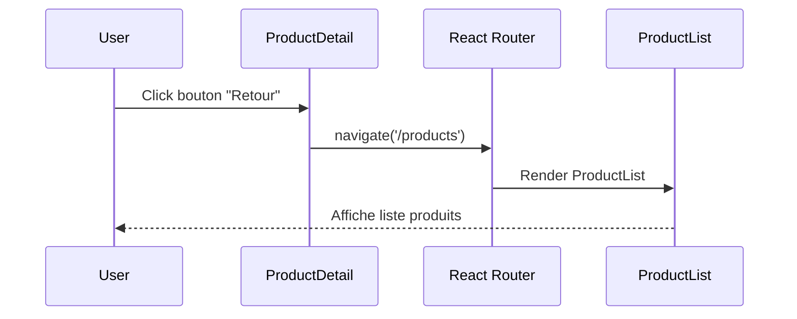
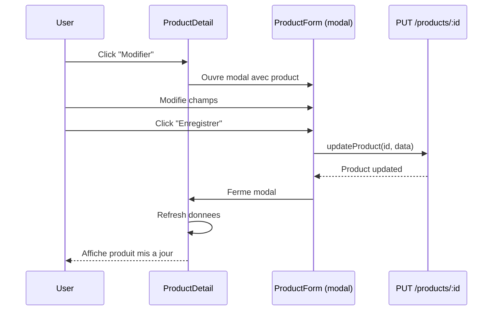
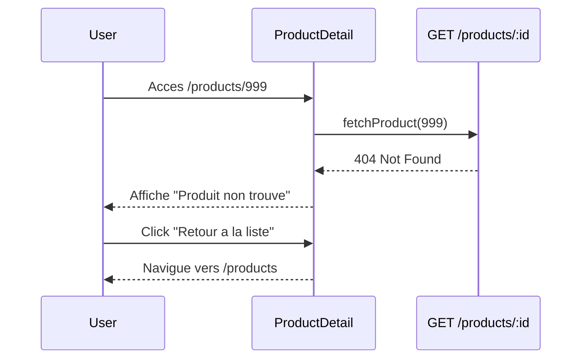

# Design: Page detail produit

## Architecture Decision

Ajout d'une page de detail produit accessible via `/products/:id`. Utilisation de React Router pour la navigation interne au module.

**Choix techniques :**
- React Router v6 pour le routing interne (deja utilise dans le projet)
- Composant `ProductDetail` autonome avec chargement de donnees
- Reutilisation du modal `ProductForm` existant pour la modification
- CSS Modules pour les styles (coherent avec le reste du module)

## Component Structure

### ProductDetail.tsx

```typescript
interface ProductDetailProps {
  onBack: () => void;
  onEdit: (product: Product) => void;
}

// Utilise useParams() pour recuperer l'ID depuis l'URL
// Charge le produit via fetchProduct(id)
// Affiche: nom, description, prix, categorie, stock, dates creation/modification
```

### Modifications ProductList.tsx

```typescript
interface ProductListProps {
  products: Product[];
  onView: (product: Product) => void;  // NOUVEAU
  onEdit: (product: Product) => void;
  onDelete: (product: Product) => void;
}

// Le nom du produit devient un lien cliquable
// onClick sur le nom appelle onView(product)
```

### Modifications App.tsx

```typescript
// Ajout de React Router Routes pour navigation interne
import { Routes, Route, useNavigate } from 'react-router-dom';

<Routes>
  <Route index element={<ProductListView />} />
  <Route path=":id" element={<ProductDetailView />} />
</Routes>
```

## Sequence Diagrams

### Navigation vers le detail



### Retour a la liste



### Modification depuis le detail



### Erreur produit non trouve



## Files to Create

| Fichier | Description |
|---------|-------------|
| `components/ProductDetail/ProductDetail.tsx` | Composant principal |
| `components/ProductDetail/ProductDetail.module.css` | Styles |
| `components/ProductDetail/index.ts` | Export |

## Files to Modify

| Fichier | Modification |
|---------|-------------|
| `App.tsx` | Ajouter React Router Routes |
| `components/ProductList/ProductList.tsx` | Ajouter prop `onView`, nom cliquable |
| `components/ProductList/ProductList.module.css` | Style lien cliquable |

## UI Design

### Page Detail

```
+--------------------------------------------------+
| <- Retour                              [Modifier] |
+--------------------------------------------------+
|                                                   |
|  NOM DU PRODUIT                                   |
|  ===============                                  |
|                                                   |
|  Description                                      |
|  -----------                                      |
|  Lorem ipsum dolor sit amet...                    |
|                                                   |
|  +-------------+  +-------------+  +------------+ |
|  | Prix        |  | Categorie   |  | Stock      | |
|  | 99,99 EUR   |  | Electronics |  | En stock   | |
|  +-------------+  +-------------+  +------------+ |
|                                                   |
|  Cree le: 15/01/2024                              |
|  Modifie le: 20/01/2024                           |
|                                                   |
+--------------------------------------------------+
```

## API Contract

Endpoint existant, pas de modification :

```
GET /products-api/products/:id

Response 200:
{
  "id": 123,
  "name": "Product Name",
  "description": "Description text",
  "price": 99.99,
  "category": "Electronics",
  "inStock": true,
  "createdAt": "2024-01-15T10:30:00.000Z",
  "updatedAt": "2024-01-20T14:00:00.000Z"
}

Response 404:
{
  "error": "Non trouve"
}
```
