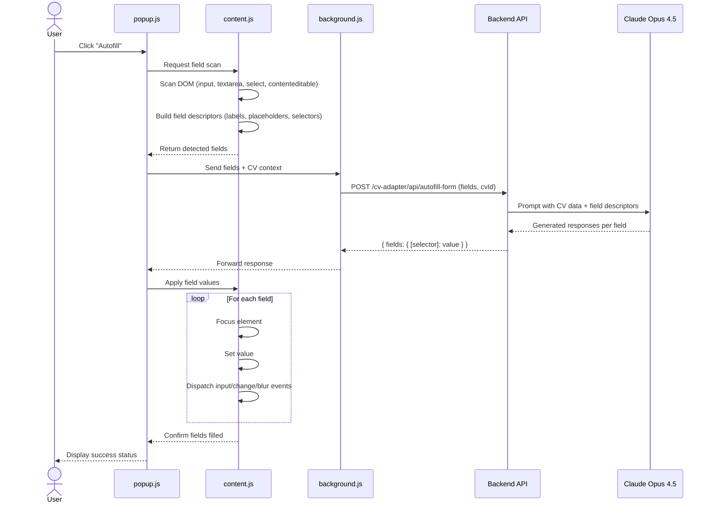
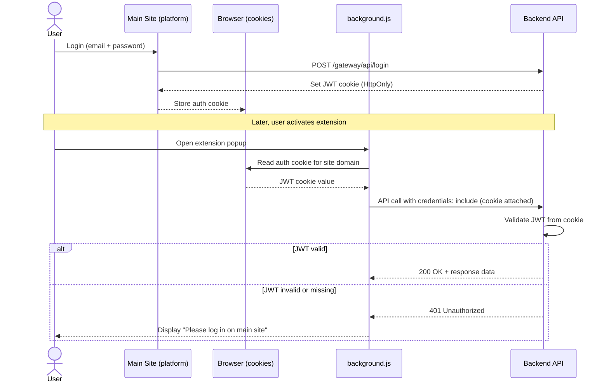
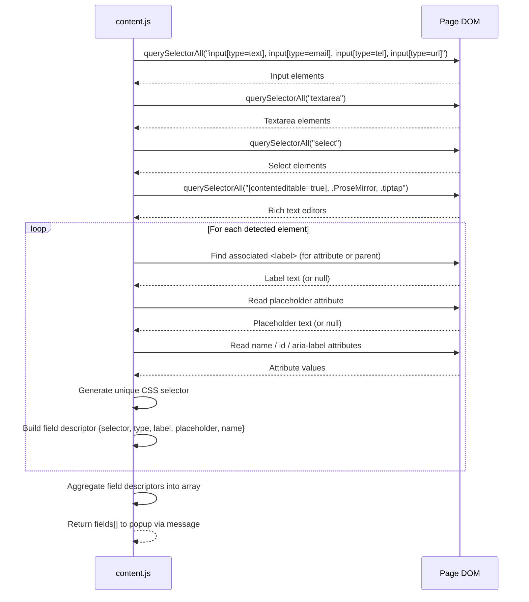

## Context

Les Phases 1 et 2 du module CV Adapter sont implémentées :
- Phase 1 : CRUD CV, import PDF/DOCX, gestion médias
- Phase 2 : Adaptation IA, génération PDF

Le projet de référence `cv-tools` contient déjà des extensions Chrome fonctionnelles pour l'autofill. Cette phase adapte ces extensions au boilerplate platform.

## Goals / Non-Goals

**Goals:**
- Permettre le remplissage automatique de formulaires de candidature
- Détecter les champs de formulaire (input, textarea, select, contenteditable)
- Générer des réponses contextuelles via Claude Opus 4.5
- Fournir une popup UI pour déclencher l'autofill
- Supporter les environnements dev (localhost) et local/prod

**Non-Goals:**
- Publication sur le Chrome Web Store (extensions locales uniquement)
- Support d'autres navigateurs (Firefox, Safari)
- Authentification OAuth dans l'extension (cookie-based auth)
- Sauvegarde des réponses générées

## Decisions

### 1. Modèle Claude pour l'autofill

**Décision**: Utiliser `claude-opus-4-5-20251101` pour la génération des réponses

**Rationale**: L'autofill nécessite une compréhension fine du contexte (CV + champ + page) et une génération de haute qualité. Opus 4.5 est le modèle le plus performant disponible.

**Alternative considérée**: Sonnet - rejeté car la qualité des réponses est critique pour les candidatures.

### 2. Architecture extension Manifest V3

**Décision**: Utiliser Manifest V3 avec:
- `popup.html/js` : Interface utilisateur
- `content.js` : Script injecté dans les pages
- `background.js` : Service worker pour l'authentification

**Rationale**: Manifest V3 est obligatoire pour les nouvelles extensions Chrome. Le service worker gère les requêtes cross-origin.

### 3. Détection des champs de formulaire

**Décision**: Scanner le DOM pour :
- `input[type=text|email|tel|url]`
- `textarea`
- `select`
- `[contenteditable=true]`
- Éditeurs rich text (ProseMirror, TipTap via class `.ProseMirror`, `.tiptap`)

**Rationale**: Couvre 99% des formulaires de candidature. Les éditeurs rich text sont courants sur les ATS modernes.

### 4. Communication extension ↔ backend

**Décision**:
- L'extension récupère le cookie d'auth depuis le site principal
- Appels API via `fetch` avec `credentials: include`
- Le backend valide le JWT cookie

**Rationale**: Pas besoin de système d'auth séparé dans l'extension. L'utilisateur doit être connecté sur le site principal.

### 5. Deux versions d'extension

**Décision**: Créer deux dossiers :
- `extensions/cv-adapter-dev/` : host_permissions `http://localhost:*`
- `extensions/cv-adapter-local/` : host_permissions configurables

**Rationale**: Les permissions d'hôte doivent être déclarées dans le manifest. Deux builds séparés simplifient la configuration.

### 6. Remplissage des champs

**Décision**: Utiliser une séquence d'events pour simuler une saisie utilisateur :
1. Focus sur l'élément
2. Définir la valeur
3. Dispatch `input`, `change`, `blur` events
4. Pour les éditeurs rich text : insérer directement dans le DOM

**Rationale**: Les frameworks React/Vue détectent les events, pas les modifications directes de `value`.

### 7. Structure de la réponse autofill

**Décision**: L'API retourne un objet `{ fields: { [selector]: value } }` où :
- `selector` : CSS selector unique généré pour chaque champ
- `value` : Réponse générée par Claude

**Rationale**: Le content script peut appliquer les valeurs de manière déterministe via les selectors.

## Sequence Diagrams

### 1. Autofill Flow

### 2. Extension Authentication

### 3. Field Detection

## Risks / Trade-offs

### [Sécurité des cookies]
L'extension accède aux cookies du site principal.
→ **Mitigation**: Seules les extensions chargées localement (unpacked) ont accès. Pas de publication publique.

### [Limitations des permissions host]
L'extension ne peut pas accéder à tous les sites sans permission explicite.
→ **Mitigation**: L'utilisateur doit accorder la permission via `activeTab` pour chaque site.

### [Coût API Opus 4.5]
Claude Opus 4.5 est le modèle le plus cher.
→ **Mitigation**: Limiter le contexte envoyé. Traiter les champs par batch si possible.

### [Compatibilité des formulaires]
Certains formulaires utilisent des structures DOM non standard.
→ **Mitigation**: Fallback sur les selectors génériques. Documentation des limitations.

### [Mise à jour des extensions]
Les extensions locales ne se mettent pas à jour automatiquement.
→ **Mitigation**: Documentation du processus de rechargement dans Chrome.
