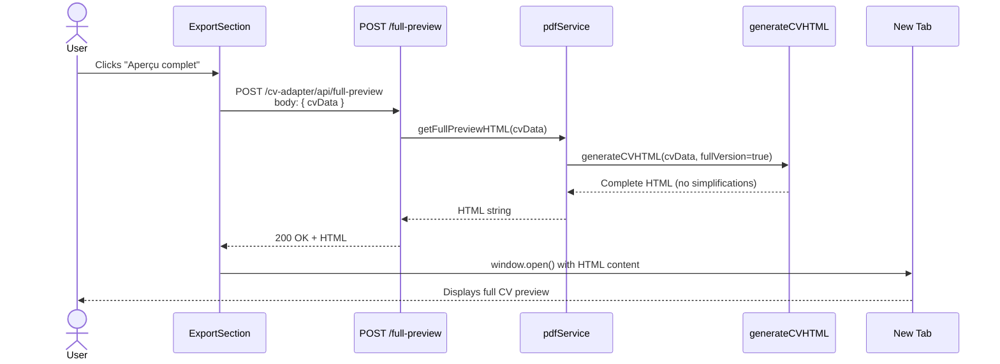
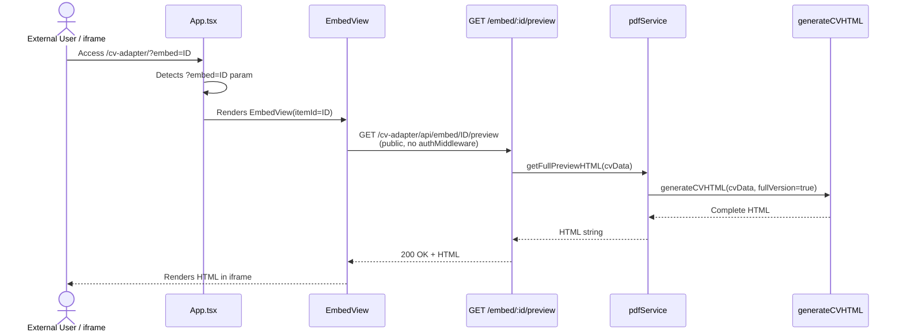

## Context

L'aperçu HTML actuel simplifie le contenu du CV pour une présentation concise. L'utilisateur souhaite également pouvoir voir une version complète avec toutes les données affichées intégralement.

Le système de génération HTML (`pdfService.ts`) peut potentiellement limiter ou simplifier certains contenus. Il faut identifier où ces simplifications se font et ajouter un paramètre pour les désactiver.

## Goals / Non-Goals

**Goals:**
- Ajouter un bouton "Aperçu complet" dans la section Export
- Créer un endpoint `/full-preview` qui génère le HTML sans simplifications
- Afficher toutes les descriptions, missions, projets et technologies en intégralité
- Garder le même template visuel (deux colonnes, thème terminal)

**Non-Goals:**
- Modifier l'aperçu HTML existant (il reste disponible)
- Appeler Claude ou faire de l'IA
- Changer le template ou le style

## Decisions

### 1. Paramètre `fullVersion` dans generateCVHTML

**Décision**: Ajouter un paramètre optionnel `fullVersion: boolean` à la fonction `generateCVHTML`.

**Rationale**:
- Réutilise le code existant
- Un seul endroit pour gérer les deux modes
- Pas de duplication de template

### 2. Nouvel endpoint `/full-preview`

**Décision**: Créer un endpoint séparé plutôt que paramètre sur `/preview`.

**Rationale**:
- API claire et explicite
- Pas de risque de casser l'existant
- Plus facile à documenter

**Alternatives considérées**:
- Paramètre `?full=true` sur `/preview` → Rejeté car modifie l'endpoint existant

### 3. Pas de modifications en base

**Décision**: L'aperçu complet est en lecture seule, rien n'est sauvegardé.

**Rationale**: Cohérent avec l'aperçu existant.

## Sequence Diagrams

### 1. Full Preview Flow (authenticated user)

### 2. Embed Preview Flow (public access, no auth)

## Risks / Trade-offs

**[Performance]** → Plus de contenu = page plus lourde
- Mitigation: Acceptable car c'est le comportement demandé

**[Consistance]** → Deux aperçus différents peuvent créer de la confusion
- Mitigation: Labels clairs "Aperçu HTML" vs "Aperçu complet"
