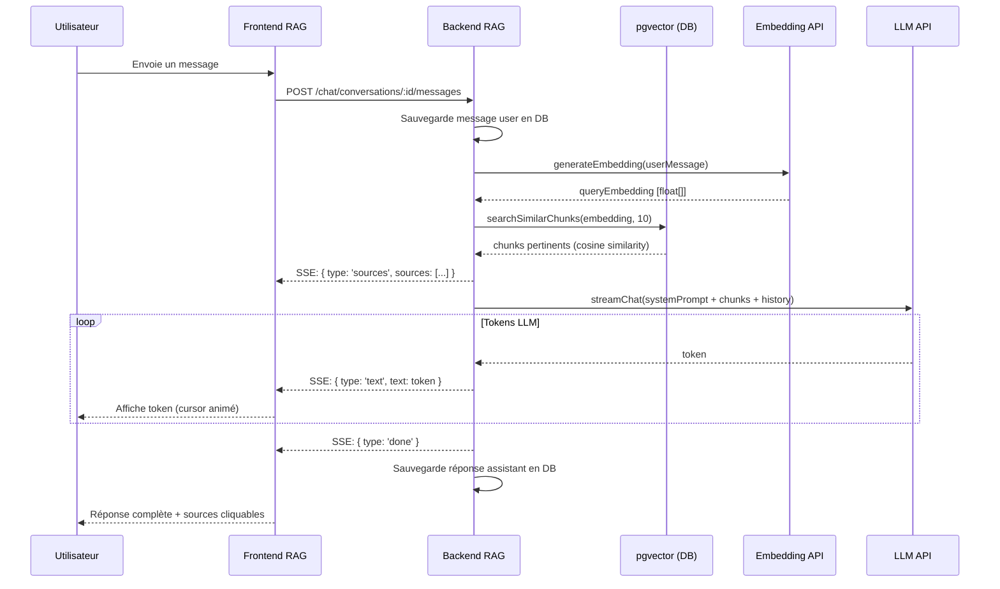
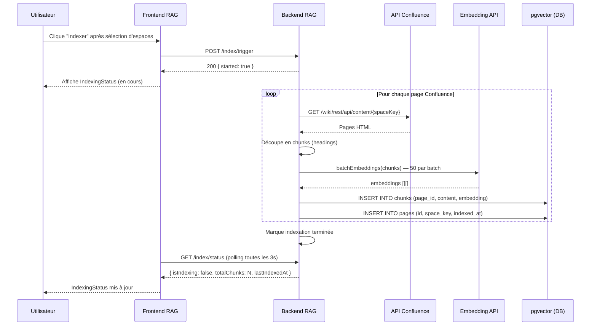
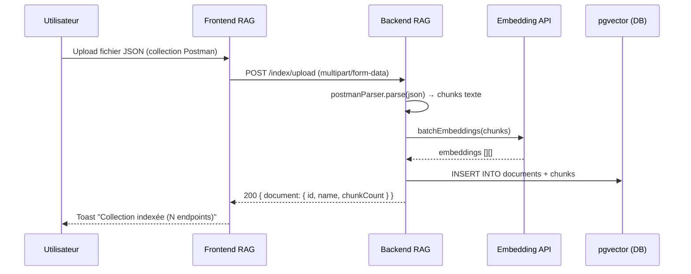
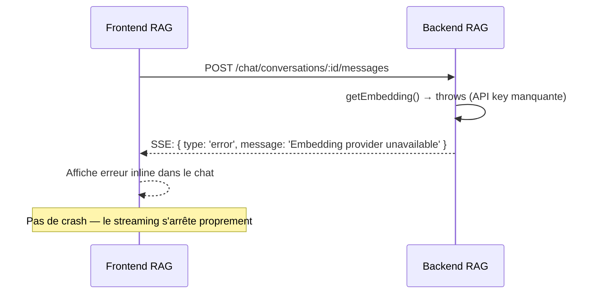
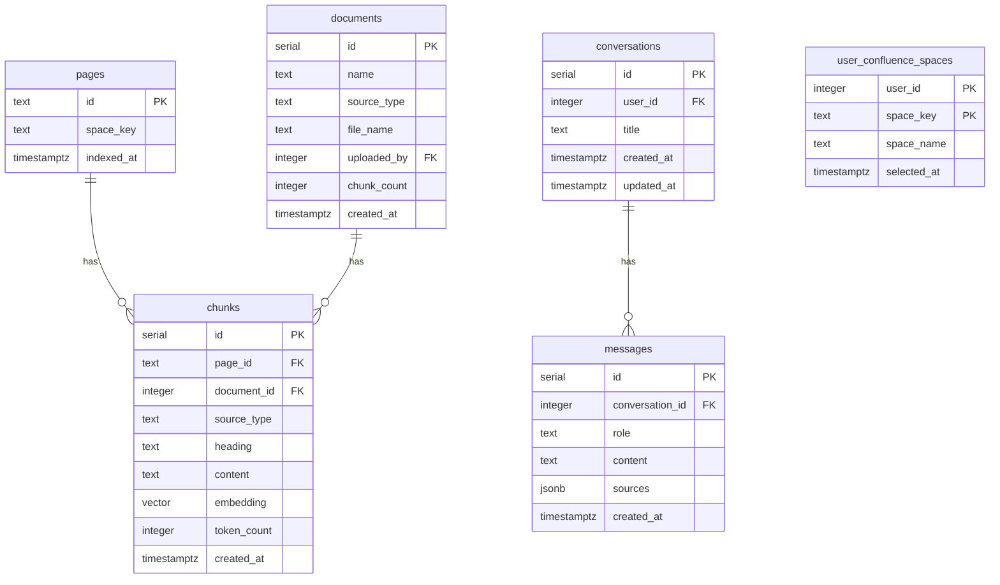

## Context

Le projet `delivery-process` contient une implémentation RAG complète et fonctionnelle (`confluence-rag`). Le portage consiste à l'adapter aux conventions boilerplate (pool partagé, authMiddleware, SharedNav, Layout, ModuleHeader, vitest config) sans en réinventer l'architecture.

**Contraintes :**
- pgvector doit être activé dans PostgreSQL (même container que le reste de la plateforme)
- Les providers LLM et embedding sont configurables via variables d'environnement
- Le module doit fonctionner sans Confluence configuré (mode dégradé : upload Postman uniquement)
- Interface full-screen uniquement — pas de widget flottant

## Goals / Non-Goals

**Goals:**
- Porter le module RAG comme module boilerplate autonome (même pattern que delivery, conges, etc.)
- Chat full-screen avec sidebar de conversations et zone de chat principale
- Streaming SSE des réponses LLM
- Indexation configurable par espace Confluence
- Upload de collections Postman
- Multi-provider : Anthropic (Claude), Scaleway, Ollama

**Non-Goals:**
- Widget flottant cross-module
- Webhooks Confluence pour sync automatique
- Indexation partagée entre utilisateurs
- Support sources tierces (Notion, GitHub, etc.)

## Décisions

### 1. Utiliser le pool PostgreSQL partagé de la plateforme

**Décision :** Le module utilise `initConfluenceRag(sharedPool)` avec le pool existant, comme `jiraAuth.ts`. Pas de pool dédié.

**Pourquoi :** Le boilerplate utilise un seul container PostgreSQL. Créer un deuxième pool consomme inutilement des connexions.

**Alternative :** Pool dédié avec `CONFLUENCE_RAG_DATABASE_URL` séparé — rejeté (complexité opérationnelle).

### 2. pgvector sur la base `app` existante

**Décision :** L'extension pgvector et les tables RAG sont créées dans la base `app` existante (pas de base séparée).

**Pourquoi :** Simplifie le déploiement. pgvector est léger et compatible avec PostgreSQL 14+.

**Migration :** `CREATE EXTENSION IF NOT EXISTS vector;` + tables dans `11_confluence_rag_schema.sql`.

### 3. Provider LLM par défaut : Anthropic (Claude Sonnet)

**Décision :** Par défaut `LLM_PROVIDER=anthropic` avec `claude-sonnet-4-6`. Fallback Ollama si configuré.

**Pourquoi :** Cohérent avec le reste de la plateforme qui utilise l'API Anthropic.

### 4. Dimension d'embedding : détection automatique

**Décision :** À l'init, le module vérifie la dimension actuelle des chunks en DB. Si le provider change (et donc la dimension), il drop et recrée la table `chunks` automatiquement.

**Pourquoi :** Évite les erreurs de dimension incompatible lors du changement de provider.

### 5. Layout full-screen 2 colonnes (sidebar + chat)

**Décision :** Le module utilise `Layout` + `ModuleHeader` du design system. La zone principale est divisée en 2 : sidebar conversations (240px) + zone chat (flex: 1).

**Pourquoi :** Cohérence avec les autres modules. La sidebar conversations suit le pattern de la `ConversationList` existante.

## Contrats API

| Méthode | Chemin | Description |
|---------|--------|-------------|
| `GET` | `/confluence-rag/api/chat/conversations` | Liste les conversations de l'utilisateur |
| `POST` | `/confluence-rag/api/chat/conversations` | Crée une nouvelle conversation |
| `DELETE` | `/confluence-rag/api/chat/conversations/:id` | Supprime une conversation |
| `GET` | `/confluence-rag/api/chat/conversations/:id/messages` | Messages d'une conversation |
| `POST` | `/confluence-rag/api/chat/conversations/:id/messages` | Envoie un message (SSE streaming) |
| `GET` | `/confluence-rag/api/index/spaces/available` | Espaces Confluence disponibles |
| `GET` | `/confluence-rag/api/index/spaces/selected` | Espaces sélectionnés par l'utilisateur |
| `POST` | `/confluence-rag/api/index/spaces` | Met à jour les espaces sélectionnés |
| `POST` | `/confluence-rag/api/index/trigger` | Déclenche l'indexation |
| `GET` | `/confluence-rag/api/index/status` | Statut de l'indexation |
| `POST` | `/confluence-rag/api/index/upload` | Upload d'une collection Postman |

### Payloads

```typescript
// Conversation
interface Conversation {
  id: number;
  title: string | null;
  createdAt: string;
  updatedAt: string;
}

// Message
interface Message {
  id: number;
  conversationId: number;
  role: 'user' | 'assistant';
  content: string;
  sources?: Source[];
  createdAt: string;
}

interface Source {
  pageId: string;
  title: string;
  url: string;
  spaceKey: string;
  heading?: string;
}

// SSE stream events
type StreamEvent =
  | { type: 'sources'; sources: Source[] }
  | { type: 'text'; text: string }
  | { type: 'done' }
  | { type: 'error'; message: string };

// Indexing status
interface IndexingStatus {
  isIndexing: boolean;
  lastIndexedAt: string | null;
  totalChunks: number;
  totalPages: number;
}

// Space
interface ConfluenceSpace {
  key: string;
  name: string;
  selected: boolean;
}
```

## Diagrammes de séquence

### Flux : envoi d'un message avec streaming SSE



### Flux : indexation d'un espace Confluence



### Flux : upload collection Postman



### Flux : erreur LLM / Jira non configuré



## Modèle de données (ERD)



## Risques / Trade-offs

| Risque | Mitigation |
|--------|-----------|
| pgvector non installé sur le container PostgreSQL | Script SQL vérifie `CREATE EXTENSION IF NOT EXISTS vector` — erreur explicite au démarrage si absent |
| Dimension d'embedding incompatible après changement de provider | Auto-détection + drop/recreate de `chunks` à l'init |
| Indexation longue bloquant le serveur | Indexation asynchrone en background (`setImmediate`) |
| Rate limit embedding API | Batches de 50 avec délai de 200ms entre chaque |
| Confluence non configuré | Mode dégradé : upload Postman uniquement, message explicite dans l'UI |

## Plan de migration

1. Activer pgvector : `CREATE EXTENSION IF NOT EXISTS vector;` via `11_confluence_rag_schema.sql`
2. Appliquer le schema à la DB Docker existante
3. Configurer les variables d'environnement LLM (au moins `ANTHROPIC_API_KEY`)
4. Configurer optionnellement Confluence (`CONFLUENCE_BASE_URL`, `JIRA_EMAIL`, `JIRA_API_TOKEN`)
5. Déployer le module — il s'enregistre dans SharedNav automatiquement

**Rollback :** Retirer le module du server index.ts suffit. Les tables pgvector restent mais n'impactent pas les autres modules.

## Open Questions

- Faut-il un système de permissions granulaire (certains espaces Confluence accessibles seulement à certains utilisateurs) ? → Non pour la v1, tout utilisateur ayant `confluence-rag` dans ses permissions accède à tout.
- Le titre des conversations doit-il être généré automatiquement par le LLM ? → Oui, depuis le premier message (comme dans `delivery-process`).
