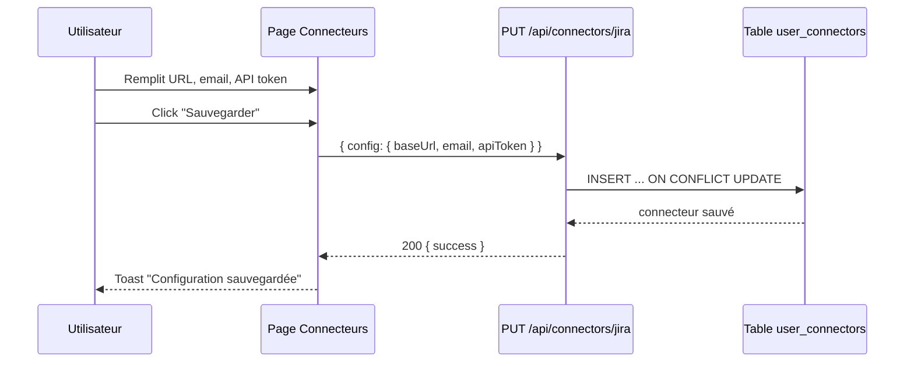
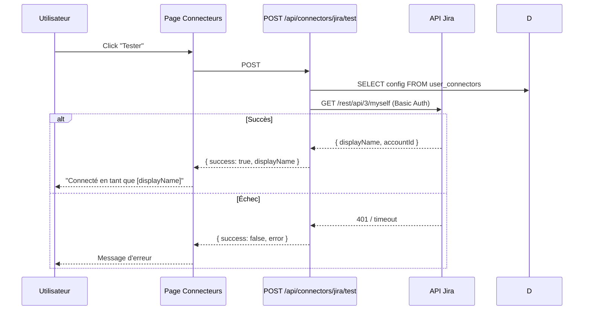
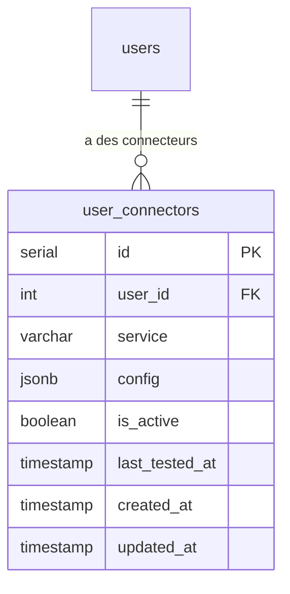

## Contexte

Les utilisateurs doivent pouvoir connecter des services externes (Jira, Notion, ClickUp) sans avoir accès aux fichiers de configuration serveur. La configuration se fait via l'UI et est stockée par utilisateur en base.

## Décisions

### 1. Credentials stockés en JSONB par utilisateur
Chaque connecteur a un champ `config JSONB` flexible qui stocke les champs spécifiques au service. Pour Jira : `{ baseUrl, email, apiToken }`.

### 2. Pas de chiffrement des tokens pour le moment
Même approche que delivery-process — les tokens sont stockés en clair en DB. Le chiffrement peut être ajouté plus tard.

### 3. Test de connexion côté serveur
Le backend fait un appel `GET /rest/api/3/myself` à l'API Jira avec Basic Auth pour vérifier les credentials.

### 4. Sanitization des réponses
L'API masque les tokens dans les réponses GET (remplacé par `***masked***`) pour ne jamais envoyer les secrets au frontend inutilement.

## Contrats API

| Méthode | Chemin | Description |
|---------|--------|-------------|
| GET | /api/connectors | Liste des connecteurs de l'utilisateur (tokens masqués) |
| PUT | /api/connectors/:service | Créer/modifier un connecteur |
| DELETE | /api/connectors/:service | Supprimer un connecteur |
| POST | /api/connectors/:service/test | Tester la connexion |

## Diagrammes de séquence

### Configurer Jira

### Tester la connexion Jira

## Modèle de données

