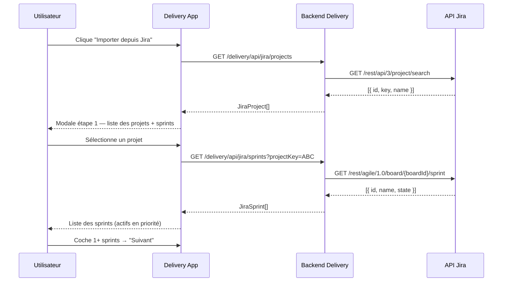
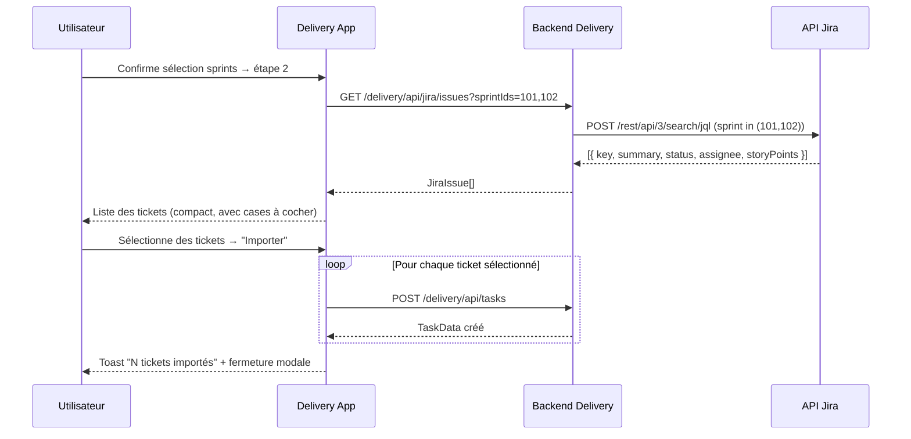
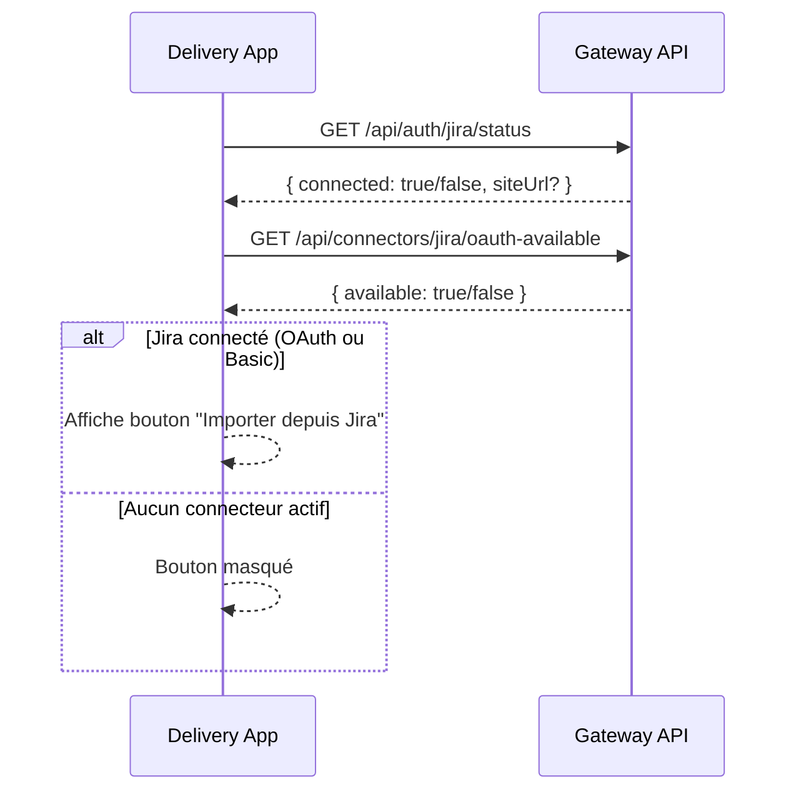
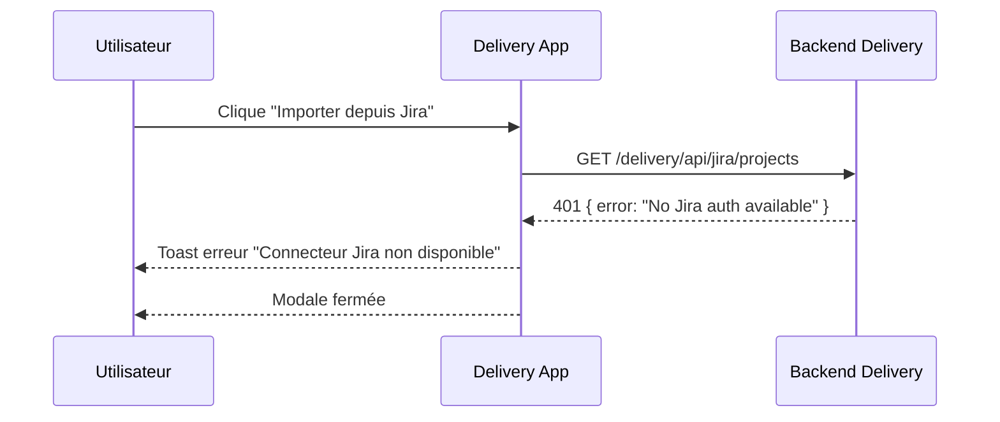

## Context

Le module Delivery Board permet de gérer les tâches d'un incrément. Les tâches sont actuellement créées manuellement. Les équipes utilisent Jira pour gérer leurs sprints, ce qui crée une double saisie et un risque d'incohérence.

L'infrastructure d'authentification Jira (OAuth + Basic) est déjà en place via `jiraAuth.ts`. Le backend delivery expose déjà `POST /delivery/api/tasks` pour créer des tâches. Il faut créer un pont entre l'API Jira et le board delivery.

**Contraintes :**
- Le bouton d'import ne doit apparaître que si Jira est connecté (OAuth ou Basic Auth)
- L'import est en lecture seule côté Jira (pas d'écriture)
- Tous les tickets importés ont le statut `todo` — pas de mapping de statuts Jira
- Pas de nouvelle table DB — les tickets importés deviennent des `Task` ordinaires

## Goals / Non-Goals

**Goals:**
- Afficher un bouton "Importer depuis Jira" conditionnel dans le header du board
- Proxy backend vers l'API Jira (projets, sprints, tickets) via `jiraAuth`
- Modale 2 étapes : sélection sprints → sélection tickets → import en masse
- Création des tickets sélectionnés via l'endpoint existant `POST /delivery/api/tasks`

**Non-Goals:**
- Synchronisation bidirectionnelle Jira ↔ Delivery
- Mise à jour des statuts Jira depuis le board
- Import automatique / webhooks
- Mapping des statuts Jira (`In Progress`, `Done`, etc.) → statuts delivery
- Déduplication (si un ticket est importé deux fois, il crée deux tâches)

## Décisions

### 1. Proxy backend — pas d'appels Jira directs depuis le frontend

**Décision :** Les appels Jira transitent par 3 endpoints backend dans `delivery/routes.ts`.

**Pourquoi :** `jiraAuth.ts` tourne côté serveur (accès aux secrets OAuth, à la DB). Le frontend ne peut pas construire les headers d'authentification Jira. Le proxy évite d'exposer les tokens.

**Alternatives considérées :**
- Endpoint générique `/delivery/api/jira-proxy?path=...` — rejeté, trop permissif et difficile à sécuriser
- Endpoint dans gateway — rejeté, le module delivery doit être autonome

### 2. Contrôle de visibilité du bouton via `/api/auth/jira/status` + `/api/connectors/jira/oauth-available`

**Décision :** `App.tsx` interroge l'endpoint de statut OAuth et la présence d'identifiants Basic pour décider d'afficher le bouton.

**Pourquoi :** `jiraAuth.ts` retourne `null` si aucune auth n'est disponible. On vérifie côté client via les endpoints déjà existants (gateway). Si les deux retournent `false`/`inactive`, le bouton est caché.

### 3. Modale 2 étapes (projets+sprints → tickets)

**Décision :** Étape 1 = sélection des sprints par projet. Étape 2 = affichage des tickets des sprints sélectionnés avec sélection multiple.

**Pourquoi :** L'API Jira Agile ne permet pas de lister tous les sprints sans passer par un projet. L'étape 1 filtre le volume ; l'étape 2 affiche uniquement les tickets pertinents.

### 4. Import via l'endpoint existant `POST /delivery/api/tasks`

**Décision :** Chaque ticket sélectionné est créé individuellement via `POST /delivery/api/tasks` en séquence (ou en parallèle avec `Promise.all`).

**Pourquoi :** L'endpoint existant est robuste et déjà testé. Un endpoint d'import en masse serait du sur-engineering pour une v1.

## Contrats API

| Méthode | Chemin | Description |
|---------|--------|-------------|
| `GET` | `/delivery/api/jira/projects` | Liste les projets Jira de l'utilisateur |
| `GET` | `/delivery/api/jira/sprints?projectKey=XXX` | Liste les sprints actifs/récents d'un projet |
| `GET` | `/delivery/api/jira/issues?sprintIds=1,2,3` | Liste les tickets des sprints sélectionnés |

### Payloads

```typescript
// GET /delivery/api/jira/projects
interface JiraProject {
  id: string;
  key: string;
  name: string;
  avatarUrl?: string;
}
type ProjectsResponse = JiraProject[];

// GET /delivery/api/jira/sprints?projectKey=XXX
interface JiraSprint {
  id: number;
  name: string;
  state: 'active' | 'closed' | 'future';
  startDate?: string;
  endDate?: string;
}
type SprintsResponse = JiraSprint[];

// GET /delivery/api/jira/issues?sprintIds=1,2,3
interface JiraIssue {
  id: string;
  key: string;          // ex: "PROJ-42"
  summary: string;
  status: string;       // statut Jira brut (non mappé)
  assignee?: string;    // display name
  storyPoints?: number; // customfield_10016
  sprintName?: string;  // nom du sprint d'origine
  issueType: string;    // Story, Bug, Task...
}
type IssuesResponse = JiraIssue[];

// Import — utilise POST /delivery/api/tasks (existant)
interface CreateTaskPayload {
  title: string;        // "[KEY] summary"
  type: 'feature' | 'tech' | 'bug';  // mappé depuis issueType
  status: 'todo';       // toujours 'todo' à l'import
  storyPoints?: number;
  assignee?: string;
  sprintName?: string;
  incrementId?: string; // incrément courant
}
```

## Diagrammes de séquence

### Flux : ouverture de la modale et sélection des sprints



### Flux : affichage des tickets et import



### Flux : vérification connecteur Jira (bouton conditionnel)



### Flux : erreur Jira (token expiré / indisponible)



## Risques / Trade-offs

| Risque | Mitigation |
|--------|-----------|
| Quota API Jira dépassé (rate limit) | Afficher un message d'erreur clair ; pas de retry automatique en v1 |
| `boardId` non trouvé pour un projet (projets sans board Agile) | Filtrer les projets sans board dans la réponse `/projects` |
| Import de doublons (même ticket importé deux fois) | Accepté en v1 — documenté dans les Non-Goals |
| `customfield_10016` (story points) varie selon instance Jira | Lire le champ, si absent retourner `undefined` (pas d'erreur) |
| Modale lente sur beaucoup de tickets | Pagination côté backend (max 100 issues par appel Jira JQL) |

## Plan de migration

Pas de migration DB nécessaire. Les nouveaux endpoints backend sont additifs. Le bouton UI est conditionnel — aucun impact sur les utilisateurs sans Jira connecté.

**Rollout :**
1. Déployer le backend (3 endpoints proxy)
2. Déployer le frontend (bouton + modale)
3. Vérifier avec un compte Jira connecté

**Rollback :** Revert du frontend suffit — le bouton disparaît, les tâches déjà importées restent en base (comportement souhaité).

## Open Questions

- Faut-il afficher un badge ou une mention "importé depuis Jira" sur les tâches créées ? (proposé hors scope v1, à décider pour v2)
- Le `boardId` est nécessaire pour l'API Agile de Jira — faut-il l'exposer dans la liste des projets ou faire une résolution automatique ?
