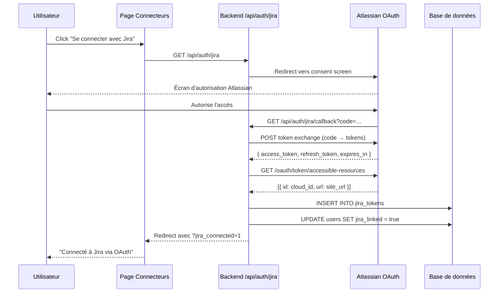
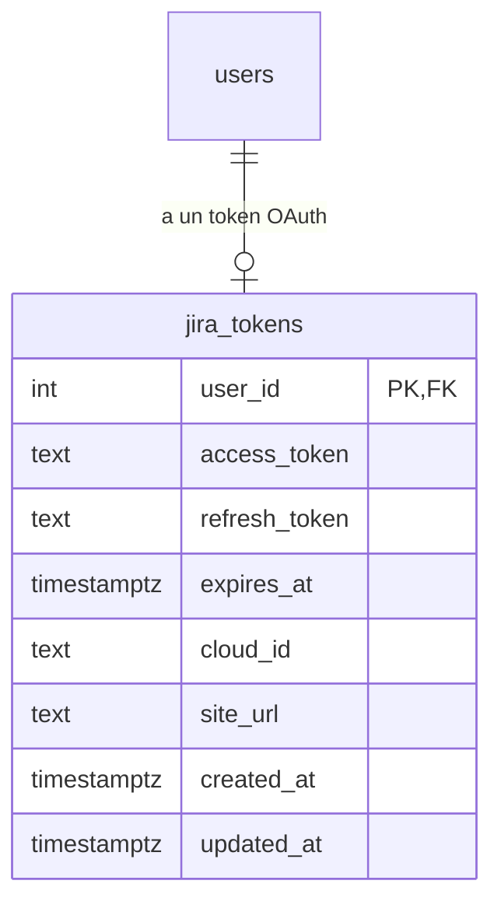

## Contexte

Le boilerplate a une page Connecteurs avec un mode Basic Auth pour Jira. On ajoute un mode OAuth 2.0 (3LO) en portant le code de delivery-process. Les deux modes coexistent via des onglets dans la carte Jira.

## Décisions

### 1. Deux onglets : "Token API" et "OAuth"
L'onglet OAuth n'est affiché que si les env vars `JIRA_OAUTH_CLIENT_ID` et `JIRA_OAUTH_CLIENT_SECRET` sont définies. Sinon seul le mode Basic Auth est disponible.

### 2. Porter jiraAuth.ts depuis delivery-process
Le fichier `jiraAuth.ts` gère le token refresh et le fallback Basic Auth. Porté tel quel avec adaptation des imports.

### 3. Endpoints OAuth dans gateway.ts
Les routes `/api/auth/jira`, `/api/auth/jira/callback`, `/api/auth/jira/status`, `DELETE /api/auth/jira` sont ajoutées au gateway existant.

### 4. Table jira_tokens dans la base app
Ajoutée via migration SQL. Colonne `jira_linked` ajoutée à la table `users`.

## Contrats API

| Méthode | Chemin | Description |
|---------|--------|-------------|
| GET | /api/auth/jira | Redirige vers Atlassian OAuth consent |
| GET | /api/auth/jira/callback | Callback OAuth — échange code → tokens |
| GET | /api/auth/jira/status | Statut connexion OAuth de l'utilisateur |
| DELETE | /api/auth/jira | Déconnexion OAuth |

## Diagrammes de séquence

### Connexion OAuth Jira

## Modèle de données

