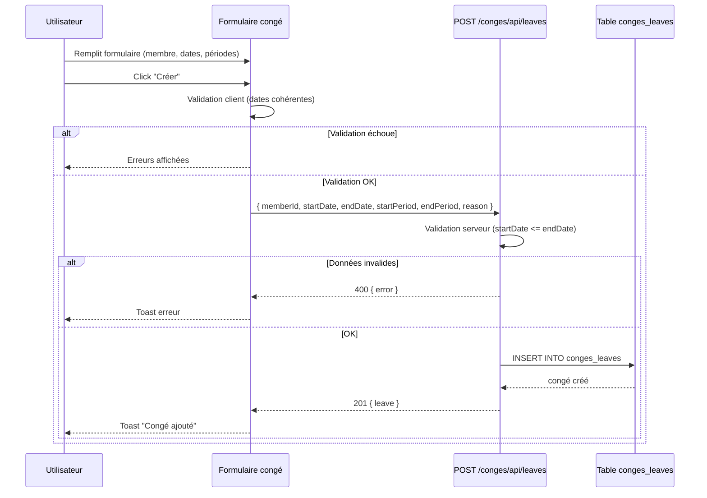
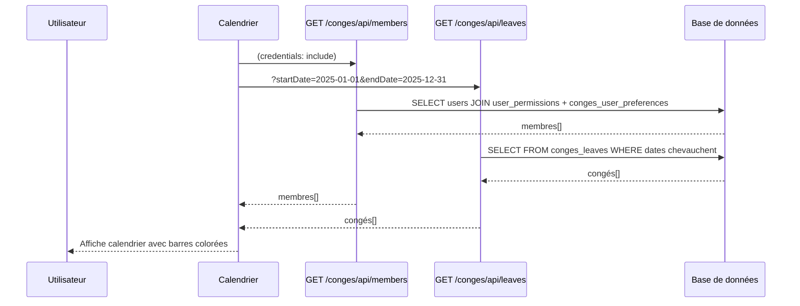
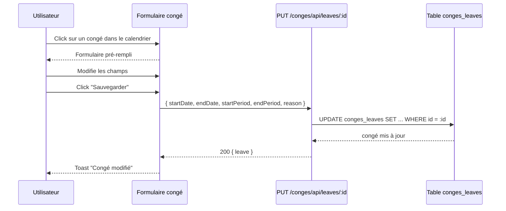
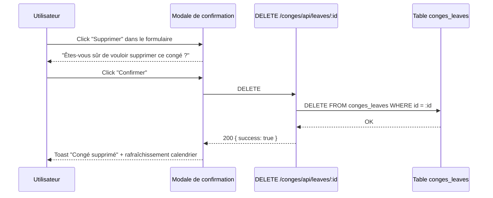
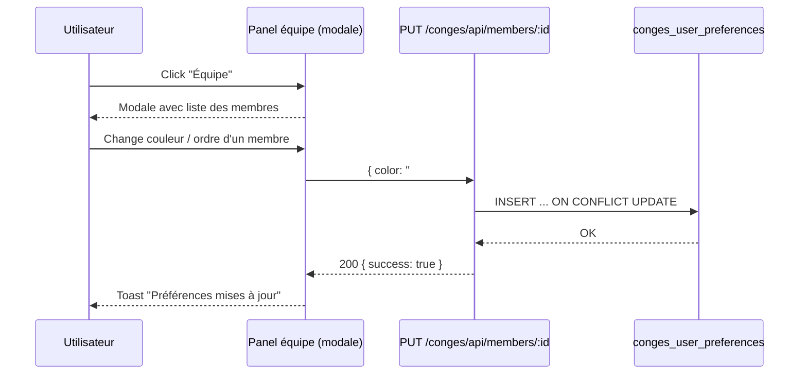
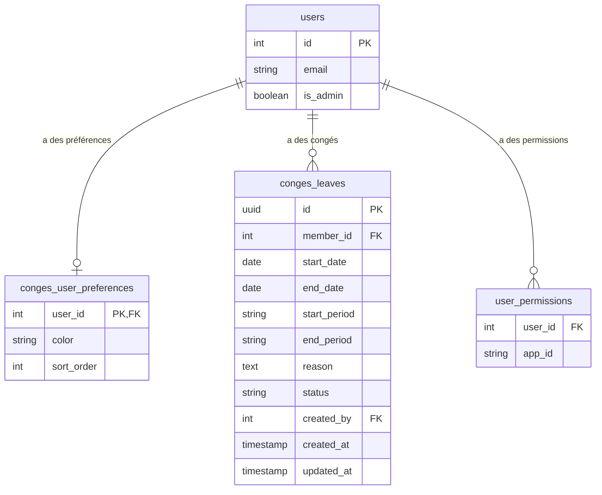

## Contexte

Le boilerplate a une architecture modulaire avec `products` comme module de référence. On porte le module `conges` depuis `delivery-process`, en supprimant toutes les références Jira/marque pour le rendre totalement standalone. Le module source est déjà fonctionnel — c'est une adaptation, pas une construction from scratch.

Les membres sont dérivés de la table `users` du gateway (utilisateurs ayant la permission `conges`). Pas besoin de table membre séparée — uniquement une table de préférences pour la couleur/ordre de tri par utilisateur.

## Objectifs / Hors périmètre

**Objectifs :**
- Module standalone de gestion des congés respectant exactement les patterns du boilerplate
- Vue calendrier avec barres colorées par membre, navigation annuelle, zoom mois/semaine
- Support demi-journée (matin/après-midi)
- Permissions admin vs utilisateur standard (les admins gèrent tout, les utilisateurs gèrent les leurs)
- Marque blanche : zéro référence à delivery-process, france-tv ou toute marque

**Hors périmètre :**
- Workflow d'approbation (les congés sont créés directement, pas d'état "en attente")
- Système de notification par email
- Intégration avec des systèmes RH externes
- Gestion de solde/quota de congés
- Fonctionnalité d'export (CSV, PDF)

## Décisions

### 1. Membres issus du gateway (pas de table séparée)
Les membres sont les utilisateurs ayant la permission `conges` dans `user_permissions`. Le backend requête `users` jointé avec `user_permissions` pour obtenir la liste. Une table `conges_user_preferences` stocke couleur et ordre de tri.

**Justification** : Évite de dupliquer les données utilisateur. Le gateway gère déjà les utilisateurs et permissions. C'est le pattern utilisé dans delivery-process et ça garde le module léger.

### 2. Base de données dans `app` (pas séparée)
Toutes les tables utilisent la base `app` avec le préfixe `conges_`, cohérent avec le fonctionnement de `products` dans le boilerplate.

**Justification** : Le boilerplate utilise une seule base `app`. La version delivery-process utilisait une base `conges` séparée, mais c'était spécifique à leur architecture multi-bases.

### 3. Adaptation des imports de `@delivery-process/shared` vers `@boilerplate/shared`
Tous les imports de composants partagés changent de `@delivery-process/shared/*` vers `@boilerplate/shared/*`. Les composants utilisés (Layout, ModuleHeader, Modal, ConfirmModal, Toast, LoadingSpinner) existent tous dans le package shared du boilerplate.

### 4. Type ViewMode défini localement
La source importe `ViewMode` depuis `@delivery-process/shared/utils`. On définit ce type localement dans `types/index.ts` du module car c'est un simple union type (`'month' | 'week'`).

### 5. CSS utilise les design tokens du boilerplate
Tous les styles utilisent les tokens `var(--*)` de `packages/shared/src/styles/theme.css`. Pas de couleurs en dur. Esthétique terminal (monospace, coins carrés, accent cyan).

## Contrats API

### Endpoints

| Méthode | Chemin | Description |
|---------|--------|-------------|
| GET | /conges/api/members | Liste des membres (utilisateurs avec permission conges) |
| PUT | /conges/api/members/:id | Modifier les préférences d'un membre (couleur, ordre) |
| GET | /conges/api/leaves?startDate=&endDate= | Congés dans une plage de dates |
| POST | /conges/api/leaves | Créer un congé |
| PUT | /conges/api/leaves/:id | Modifier un congé |
| DELETE | /conges/api/leaves/:id | Supprimer un congé |

### Payloads

```typescript
// Réponse GET /members
interface Member {
  id: number;
  email: string;
  color: string;
  sortOrder: number;
}

// Requête POST /leaves
interface LeaveFormData {
  memberId: number;
  startDate: string;      // YYYY-MM-DD
  endDate: string;        // YYYY-MM-DD
  startPeriod: 'full' | 'morning' | 'afternoon';
  endPeriod: 'full' | 'morning' | 'afternoon';
  reason: string;
}

// Réponse Leave
interface Leave {
  id: string;             // UUID
  memberId: number;
  startDate: string;
  endDate: string;
  startPeriod: 'full' | 'morning' | 'afternoon';
  endPeriod: 'full' | 'morning' | 'afternoon';
  reason: string | null;
  status: string;
  createdBy: number | null;
  createdAt: string;
  updatedAt: string;
}
```

## Diagrammes de séquence

### Créer un congé



### Charger le calendrier



### Modifier un congé



### Supprimer un congé



### Modifier les préférences d'un membre



## Modèle de données



## Risques / Compromis

- **[Risque] Le CSS source peut utiliser des tokens spécifiques à delivery-process** → Auditer tous les fichiers CSS et remplacer par les tokens du boilerplate. Le thème terminal est différent.
- **[Risque] La requête membres dépend du middleware auth du gateway** → Le middleware est déjà disponible et testé. L'objet `req.user` fournit `id`, `email`, `isAdmin`.
- **[Compromis] Pas de workflow d'approbation** → Garde le module simple. Peut être ajouté plus tard comme capacité séparée sans changement cassant.
