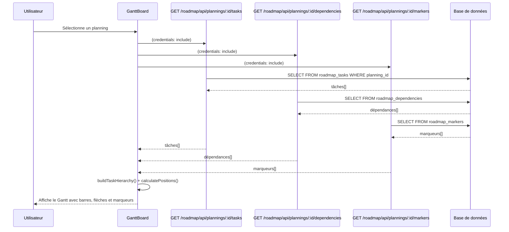
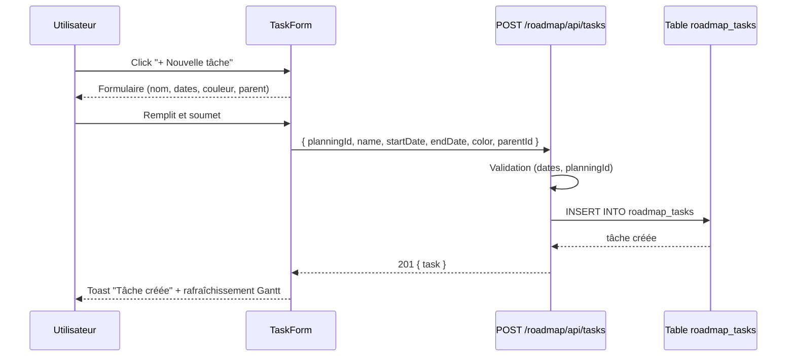
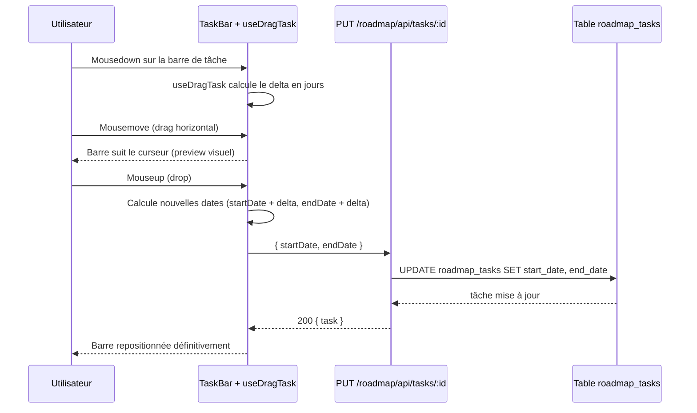
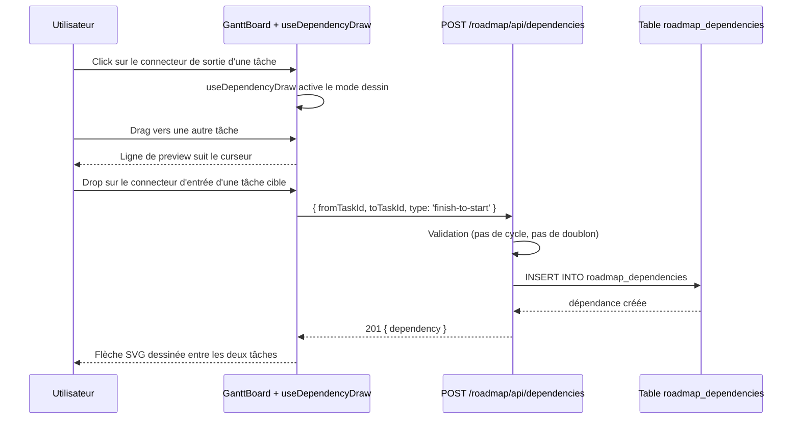
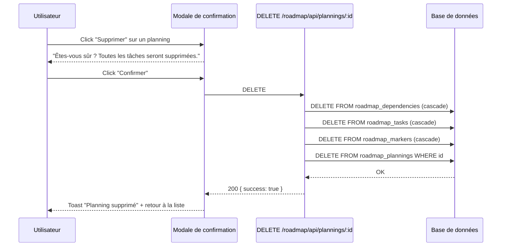
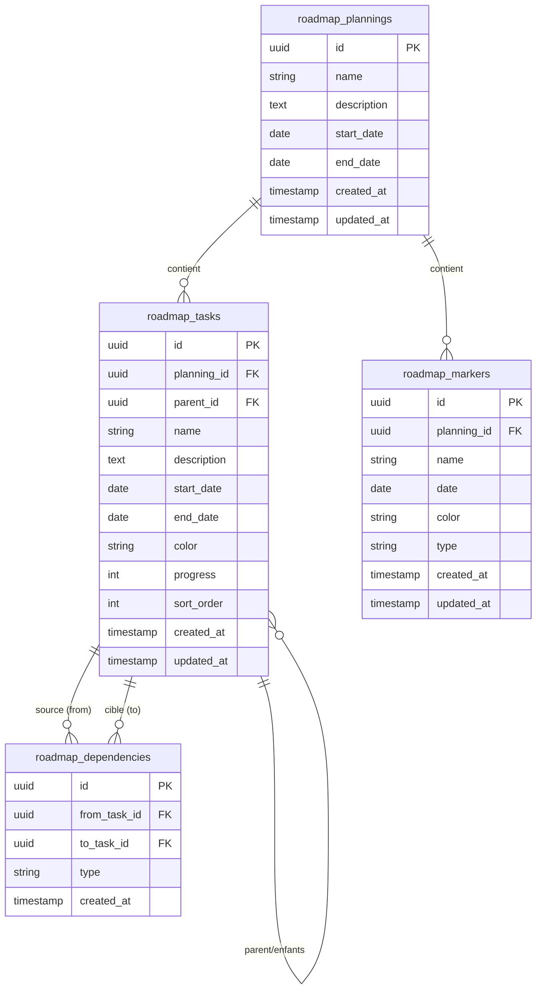

## Contexte

Le boilerplate a une architecture modulaire avec `products` et `conges` comme modules existants. On porte le module `roadmap` depuis `delivery-process`, en retirant toute intégration Jira et toute référence de marque. Le module source est un Gantt interactif complet (~3000 lignes) — c'est le plus complexe des modules à porter.

Le module congés a établi le pattern calendrier (colonne fixe + grille scrollable + scroll sync). Le Gantt du roadmap réutilise cette même architecture mais avec des interactions avancées (drag, resize, dépendances).

## Objectifs / Hors périmètre

**Objectifs :**
- Gantt interactif standalone avec drag/resize/dépendances
- Plannings multiples avec liste et sélection
- Tâches hiérarchiques (parent/enfants avec collapse)
- Dépendances entre tâches avec flèches SVG
- Marqueurs génériques (jalons, deadlines)
- Mode embed public en lecture seule
- Marque blanche : zéro référence Jira/delivery-process/france-tv

**Hors périmètre :**
- Intégration Jira (versions MEP, rules, sync tickets)
- ReleaseBoard (spécifique Jira)
- Prévisualisation HTML statique
- Gestion de ressources/charge
- Export PDF/image du Gantt

## Décisions

### 1. Réutiliser l'architecture calendrier du module congés
Le Gantt utilise le même pattern : colonne noms fixe à gauche, grille scrollable avec scroll sync header/body, today marker vertical. Les utils de date (generateColumns, getMonthGroups) sont portées localement dans `utils/dateUtils.ts` car elles ont des fonctions spécifiques au Gantt (calculateTaskPosition, business days, etc.).

**Justification** : Pattern éprouvé, cohérence UI, mais les utils sont trop spécifiques pour être partagées.

### 2. Retirer tout Jira, garder les marqueurs génériques
Les GanttMepMarker et GanttFaiMarker (spécifiques Jira) sont retirés. On garde un système de marqueurs génériques : nom, date, couleur, type. Pas de sync externe.

**Justification** : Les marqueurs sont utiles sans Jira. On peut en créer manuellement pour noter des jalons importants.

### 3. Base de données dans `app` avec préfixe `roadmap_`
4 tables : `roadmap_plannings`, `roadmap_tasks`, `roadmap_dependencies`, `roadmap_markers`. Pas de table `roadmap_jira_config`.

**Justification** : Cohérent avec le pattern boilerplate (single DB `app`, préfixe module).

### 4. Hooks de drag/resize portés tels quels
Les hooks `useDragTask`, `useResizeTask`, `useDependencyDraw`, `useDragMarker` sont portés depuis delivery-process avec adaptation minimale (tokens CSS, types locaux).

**Justification** : Ces hooks sont complexes et bien testés dans delivery-process. Pas de raison de les réécrire.

### 5. CSS utilise les design tokens exacts du boilerplate
Tous les styles utilisent les tokens de `theme.css` : `--font-family-mono`, `--accent-primary`, `--border-color`, `--border-light`, `--radius-sm`, etc. Aucune valeur hardcodée.

## Contrats API

### Endpoints

| Méthode | Chemin | Description |
|---------|--------|-------------|
| GET | /roadmap/api/plannings | Liste des plannings |
| POST | /roadmap/api/plannings | Créer un planning |
| GET | /roadmap/api/plannings/:id | Détail d'un planning |
| PUT | /roadmap/api/plannings/:id | Modifier un planning |
| DELETE | /roadmap/api/plannings/:id | Supprimer un planning |
| GET | /roadmap/api/plannings/:id/tasks | Tâches d'un planning |
| GET | /roadmap/api/plannings/:id/dependencies | Dépendances d'un planning |
| GET | /roadmap/api/plannings/:id/markers | Marqueurs d'un planning |
| POST | /roadmap/api/tasks | Créer une tâche |
| GET | /roadmap/api/tasks/:id | Détail d'une tâche |
| PUT | /roadmap/api/tasks/:id | Modifier une tâche |
| DELETE | /roadmap/api/tasks/:id | Supprimer une tâche |
| POST | /roadmap/api/dependencies | Créer une dépendance |
| DELETE | /roadmap/api/dependencies/:id | Supprimer une dépendance |
| POST | /roadmap/api/markers | Créer un marqueur |
| PUT | /roadmap/api/markers/:id | Modifier un marqueur |
| DELETE | /roadmap/api/markers/:id | Supprimer un marqueur |
| GET | /roadmap/api/embed/:id | Planning public (embed) |
| GET | /roadmap/api/embed/:id/tasks | Tâches publiques (embed) |
| GET | /roadmap/api/embed/:id/dependencies | Dépendances publiques (embed) |
| GET | /roadmap/api/embed/:id/markers | Marqueurs publics (embed) |

### Payloads

```typescript
// Planning
interface Planning {
  id: string;           // UUID
  name: string;
  description: string | null;
  startDate: string;    // YYYY-MM-DD
  endDate: string;      // YYYY-MM-DD
  createdAt: string;
  updatedAt: string;
}

// Tâche (avec hiérarchie)
interface Task {
  id: string;           // UUID
  planningId: string;
  parentId: string | null;
  name: string;
  description: string | null;
  startDate: string;
  endDate: string;
  color: string;
  progress: number;     // 0-100
  sortOrder: number;
  createdAt: string;
  updatedAt: string;
}

// Dépendance
interface Dependency {
  id: string;           // UUID
  fromTaskId: string;
  toTaskId: string;
  type: string;         // 'finish-to-start'
  createdAt: string;
}

// Marqueur
interface Marker {
  id: string;           // UUID
  planningId: string;
  name: string;
  date: string;
  color: string;
  type: string;         // 'milestone', 'deadline', 'release'
  createdAt: string;
  updatedAt: string;
}
```

## Diagrammes de séquence

### Charger un planning (vue Gantt)



### Créer une tâche



### Déplacer une tâche (drag)



### Créer une dépendance



### Supprimer un planning



## Modèle de données



## Risques / Compromis

- **[Risque] Complexité du drag/resize** → Les hooks sont portés depuis delivery-process, déjà testés. Adapter uniquement les types et imports.
- **[Risque] Performance avec beaucoup de tâches** → Le Gantt utilise des positions absolues CSS, pas de virtualisation. Suffisant pour ~200 tâches.
- **[Compromis] Pas de Jira** → Les marqueurs génériques remplacent les versions MEP. L'utilisateur crée ses jalons manuellement.
- **[Compromis] Utils de date locales** → Pas de partage avec le module congés car les fonctions Gantt sont très spécifiques (business days, snap to week, etc.).
