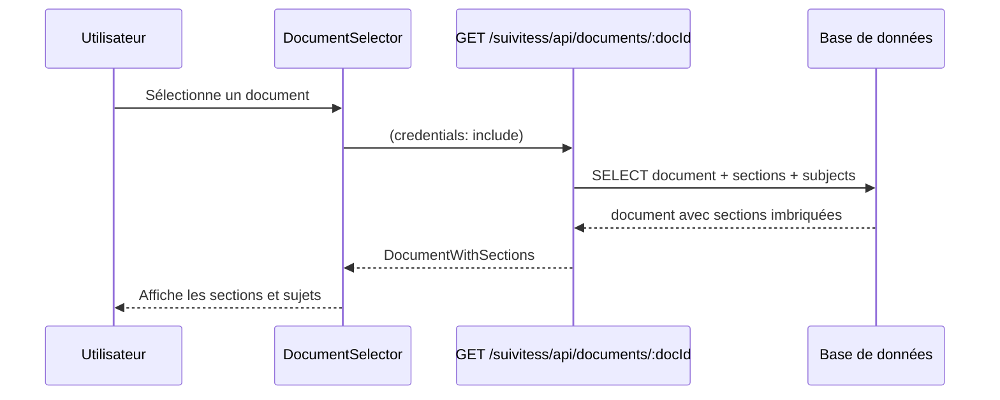
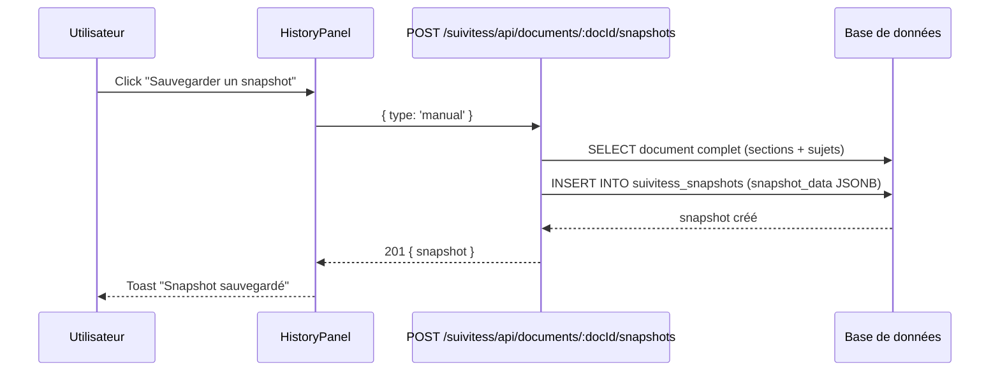
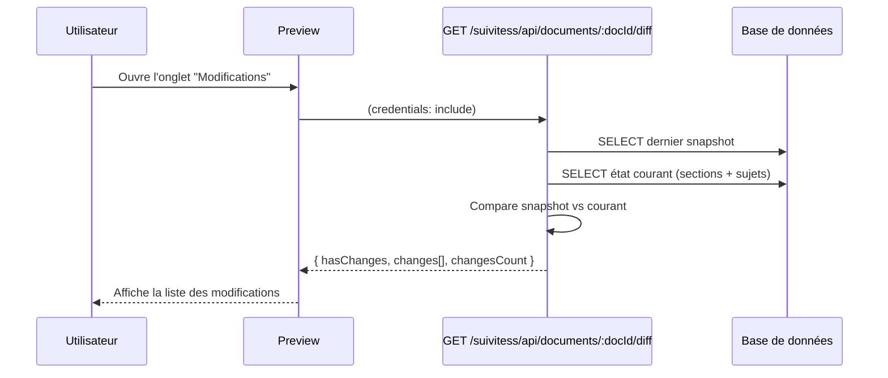
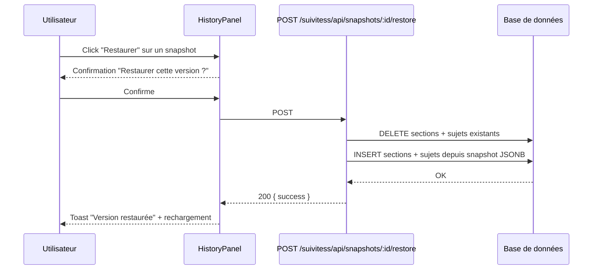
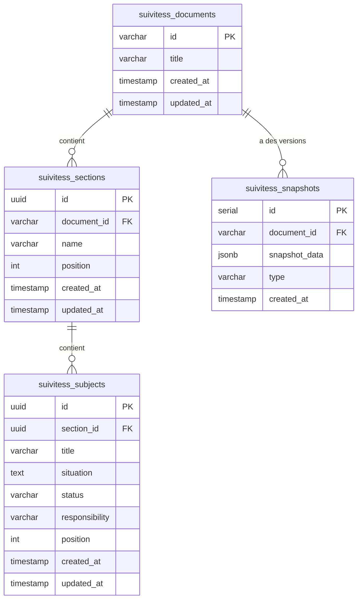

## Contexte

Portage du module `suivitess` depuis delivery-process. C'est un outil de suivi de sujets structurés en documents/sections/sujets avec versioning par snapshots. On retire Jira et l'IA (Anthropic SDK) pour garder un module standalone.

Le backend source est un fichier monolithique (~1100 lignes). On le restructure en dbService + routes comme les autres modules du boilerplate.

## Objectifs / Hors périmètre

**Objectifs :**
- Documents structurés avec sections et sujets
- Statuts emoji pour les sujets (à faire, en cours, terminé, etc.)
- Snapshots manuels avec restauration complète
- Diff entre état courant et dernier snapshot
- Wizard de revue avec édition inline
- Table des matières avec drag & drop
- Marque blanche, zéro dépendance externe

**Hors périmètre :**
- IA (reformulation, réécriture, résumé) — retirable, ajout futur possible
- Jira (création de tickets)
- Tables legacy (review_sessions, subject_changes, new_subjects)

## Décisions

### 1. Restructuration du backend monolithique
Le fichier `suivitess.ts` de delivery-process (~1100 lignes) est splitté en `dbService.ts` + `routes.ts` + `index.ts`, cohérent avec les patterns congés et roadmap.

### 2. Base de données simplifiée (4 tables au lieu de 7)
On garde uniquement : `suivitess_documents`, `suivitess_sections`, `suivitess_subjects`, `suivitess_snapshots`. Les tables legacy (review_sessions, subject_changes, new_subjects) sont retirées.

### 3. IDs de documents en slug kebab-case
Les documents utilisent un ID dérivé du titre (ex: "Suivi Projet X" → "suivi-projet-x") au lieu d'un UUID. C'est le comportement original.

### 4. Statuts avec emojis
Les statuts de sujets utilisent des emojis : 🔴 à faire, 🟡 en cours, 🔵 en analyse, 🟢 terminé, 🟣 bloqué, 🚀 à déployer.

## Contrats API

### Endpoints

| Méthode | Chemin | Description |
|---------|--------|-------------|
| GET | /suivitess/api/documents | Liste des documents |
| POST | /suivitess/api/documents | Créer un document |
| GET | /suivitess/api/documents/:docId | Document avec sections et sujets |
| PUT | /suivitess/api/documents/:docId | Modifier un document |
| DELETE | /suivitess/api/documents/:docId | Supprimer (cascade) |
| POST | /suivitess/api/documents/:docId/sections | Ajouter une section |
| POST | /suivitess/api/documents/:docId/sections/reorder | Réordonner les sections |
| PUT | /suivitess/api/sections/:sectionId | Modifier une section |
| DELETE | /suivitess/api/sections/:sectionId | Supprimer (cascade sujets) |
| POST | /suivitess/api/sections/:sectionId/subjects | Ajouter un sujet |
| POST | /suivitess/api/sections/:sectionId/subjects/reorder | Réordonner les sujets |
| PUT | /suivitess/api/subjects/:subjectId | Modifier un sujet |
| DELETE | /suivitess/api/subjects/:subjectId | Supprimer un sujet |
| POST | /suivitess/api/documents/:docId/snapshots | Créer un snapshot |
| GET | /suivitess/api/documents/:docId/snapshots | Liste des snapshots |
| GET | /suivitess/api/snapshots/:snapshotId | Données d'un snapshot |
| POST | /suivitess/api/snapshots/:snapshotId/restore | Restaurer un snapshot |
| GET | /suivitess/api/documents/:docId/diff | Diff courant vs dernier snapshot |

## Diagrammes de séquence

### Charger un document

### Créer un snapshot

### Obtenir le diff

### Restaurer un snapshot

## Modèle de données

## Risques / Compromis

- **[Compromis] Pas d'IA** → Les boutons reformuler/réécrire sont retirés. Peut être ajouté plus tard comme capacité optionnelle via env var.
- **[Compromis] Pas de Jira** → Le bouton "Créer ticket Jira" est retiré du SubjectReview.
- **[Risque] Backend monolithique** → Le split en dbService/routes doit préserver toute la logique de diff et snapshot. Porter fidèlement.
