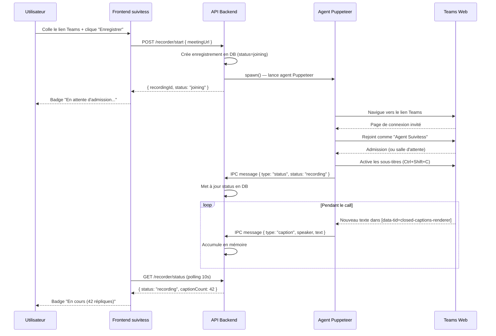
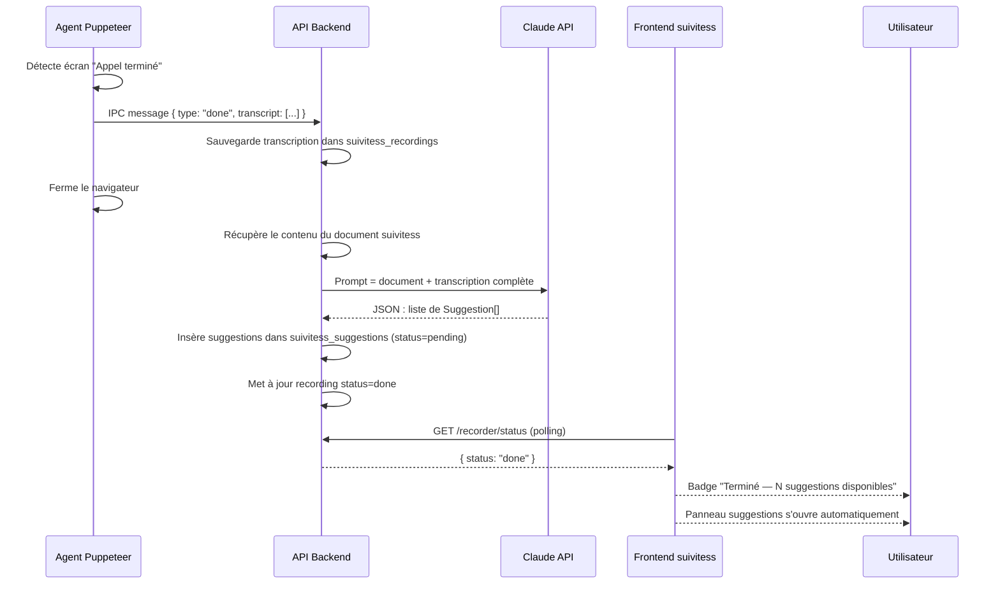
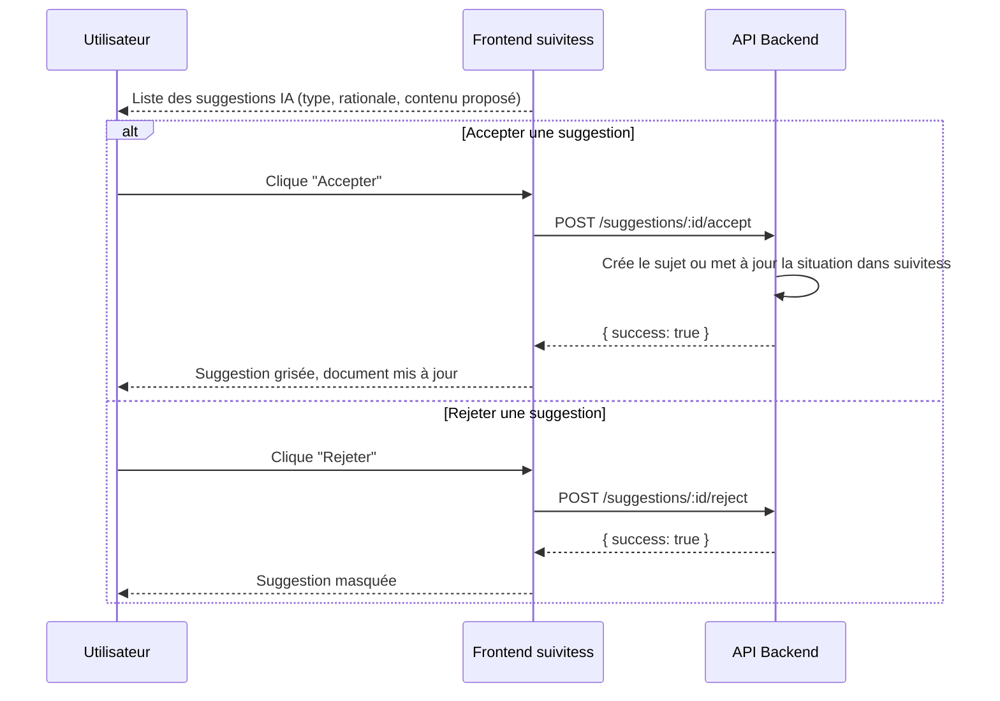
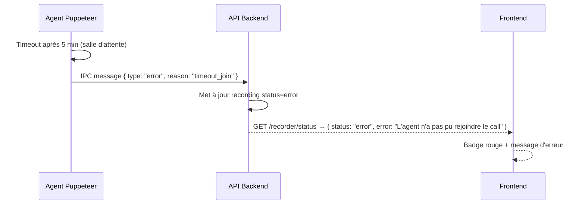
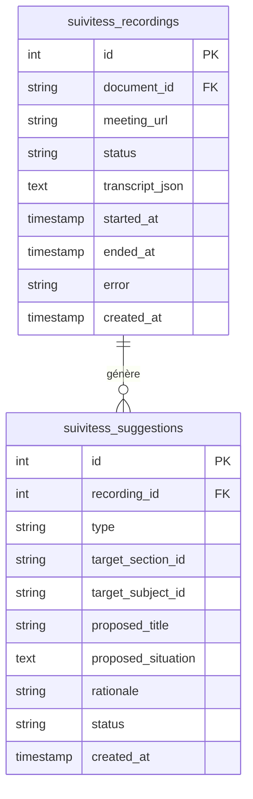

# Design — teams-transcription

## Context

Le module suivitess organise les réunions en Documents > Sections > Sujets. L'utilisateur prend ses notes pendant un call Teams mais rate des informations. L'objectif est d'envoyer un agent automatisé au call pour capturer la transcription, puis d'utiliser l'IA pour proposer des compléments aux notes prises.

**Approche retenue : Puppeteer + scraping des sous-titres Teams**
Au lieu de capturer l'audio (complexe), Puppeteer rejoint le meeting comme invité anonyme, active les sous-titres en direct de Teams, et collecte le texte via MutationObserver. Aucun traitement audio, aucune API payante.

## Goals / Non-Goals

**Goals :**
- L'utilisateur colle un lien Teams dans suivitess → bouton "Enregistrer" démarre un agent Puppeteer
- L'agent rejoint le call comme invité ("Agent Suivitess"), active les sous-titres Teams
- L'agent collecte la transcription en temps réel (locuteur + texte) jusqu'à la fin du call
- Après le call, Claude compare la transcription avec les notes du document suivitess
- L'utilisateur reçoit des propositions de complétion qu'il accepte ou rejette

**Non-Goals :**
- Support Zoom / Google Meet (V2)
- Transcription audio (wav/mp3) — le scraping des captions est suffisant
- Résumé sans révision humaine — l'utilisateur garde le contrôle
- Enregistrement vidéo

## Decisions

**D1 — Puppeteer headless avec Chromium**
Puppeteer lance un Chrome headless. Teams web (`teams.microsoft.com`) permet la connexion anonyme via le lien de réunion (nom invité : "Agent Suivitess"). Aucun compte Microsoft requis.

**D2 — Sous-titres Teams via MutationObserver**
Teams affiche les sous-titres en direct dans un conteneur DOM `[data-tid="closed-captions-renderer"]` (ou équivalent selon version Teams). Puppeteer active les sous-titres (via `Ctrl+Shift+C` ou click sur le bouton), puis injecte un script MutationObserver qui capture les changements en temps réel et les renvoie au backend via `page.exposeFunction`.

**D3 — Détection de fin de call**
Puppeteer observe le DOM pour détecter `[data-tid="call-ended-screen"]` ou l'URL qui change vers `teams.microsoft.com` (retour à l'accueil). Quand c'est détecté → fin d'enregistrement → webhook interne déclenché.

**D4 — Processus Node.js séparé pour l'agent**
Le bot Puppeteer tourne comme un processus enfant (`child_process.spawn`) lancé par le backend Express. Le statut est stocké en mémoire (Map `recordingsByDocId`) et persisté dans `suivitess_recordings`. Pas de worker threads, pas de Redis — suffisant pour un usage single-instance.

**D5 — Suggestions IA via Claude**
Après la transcription, le backend envoie à Claude :
- Le contenu du document suivitess (sections + sujets actuels)
- La transcription complète (locuteur + texte)
Claude retourne une liste de suggestions JSON (sujets à ajouter, situations à compléter). Chaque suggestion est stockée en DB et présentée à l'utilisateur pour validation.

**D6 — Architecture webhook interne**
Pas de webhook externe — l'agent Puppeteer communique avec le backend via IPC (stdio du processus enfant). Quand le call se termine, le processus enfant envoie un message JSON sur stdout et le backend traite la transcription.

## Risks / Trade-offs

- **Fragilité des sélecteurs DOM Teams** : Microsoft peut modifier le DOM de Teams web sans préavis. Les sélecteurs devront être maintenus. Mitigation : tester régulièrement + log de debug.
- **Délai de rejoindre** : Teams peut afficher une salle d'attente avant l'admission. L'agent attend jusqu'à 5 min avant de timeout.
- **Captions non disponibles** : Si la réunion n'a pas les captions configurées, Teams peut les refuser. L'agent détecte ce cas et passe en mode dégradé (aucun texte).
- **Détection bot** : Teams peut détecter un browser headless. Mitigation : `executablePath` Chromium, `--no-sandbox`, user-agent réaliste.
- **Single instance** : Un seul agent par document (et par serveur). Suffisant pour le cas d'usage.

## API Contracts

| Méthode | Path | Description |
|---------|------|-------------|
| POST | `/suivitess-api/documents/:docId/recorder/start` | Démarre l'agent Puppeteer pour ce document |
| GET | `/suivitess-api/documents/:docId/recorder/status` | Statut de l'agent (idle/joining/recording/processing/done) |
| POST | `/suivitess-api/documents/:docId/recorder/stop` | Arrête manuellement l'agent |
| GET | `/suivitess-api/documents/:docId/suggestions` | Liste les suggestions IA post-call |
| POST | `/suivitess-api/suggestions/:id/accept` | Applique la suggestion dans le document |
| POST | `/suivitess-api/suggestions/:id/reject` | Marque comme rejetée |

## Payloads

```typescript
// POST /recorder/start
interface StartRecordingRequest {
  meetingUrl: string; // Teams meeting link
}
interface StartRecordingResponse {
  recordingId: number;
  status: 'joining';
}

// GET /recorder/status
interface RecordingStatus {
  recordingId: number | null;
  status: 'idle' | 'joining' | 'recording' | 'processing' | 'done' | 'error';
  startedAt: string | null;
  captionCount: number;   // nombre de répliques capturées
  error: string | null;
}

// GET /documents/:docId/suggestions
interface Suggestion {
  id: number;
  type: 'new-subject' | 'update-situation' | 'new-section';
  targetSectionId: string | null;
  targetSubjectId: string | null;
  proposedTitle: string | null;
  proposedSituation: string | null;
  rationale: string;      // explication IA en français
  status: 'pending' | 'accepted' | 'rejected';
  createdAt: string;
}
// Response: Suggestion[]

// POST /suggestions/:id/accept → { success: true }
// POST /suggestions/:id/reject → { success: true }
```

## Sequence Diagrams

### Flux principal : démarrage de l'enregistrement



### Flux : fin du call et génération des suggestions



### Flux : révision des suggestions



### Flux : erreur — bot refusé par Teams



## Data Model



## Structure des fichiers à créer/modifier

```
# Nouveaux fichiers backend
apps/platform/servers/unified/src/modules/suivitess/
  ├── recorderAgent.ts        # Logique Puppeteer (spawn + IPC)
  ├── transcriptService.ts    # Parse IPC messages, accumule, génère suggestions
  └── suggestionsService.ts   # Appel Claude, parse suggestions JSON

# Nouvelles routes (dans routes.ts existant)
  # POST /documents/:docId/recorder/start
  # GET  /documents/:docId/recorder/status
  # POST /documents/:docId/recorder/stop
  # GET  /documents/:docId/suggestions
  # POST /suggestions/:id/accept
  # POST /suggestions/:id/reject

# Nouveaux fichiers frontend
apps/platform/src/modules/suivitess/
  ├── components/RecorderBar/
  │   ├── RecorderBar.tsx     # Champ lien Teams + bouton + badge statut
  │   └── RecorderBar.module.css
  └── components/SuggestionsPanel/
      ├── SuggestionsPanel.tsx  # Panneau latéral de révision IA
      └── SuggestionsPanel.module.css

# SQL
database/init/13_suivitess_recorder_schema.sql
```

## Variables d'environnement

| Variable | Description |
|----------|-------------|
| `PUPPETEER_EXECUTABLE_PATH` | Optionnel — chemin Chromium custom (sinon Puppeteer télécharge) |

## Dépendances npm

```json
{
  "puppeteer": "^22.0.0"
}
```
Puppeteer télécharge automatiquement Chromium à l'installation. En production (Docker), utiliser `puppeteer-core` avec Chromium installé séparément.
